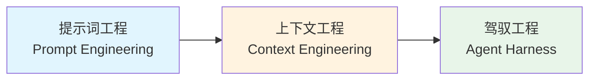
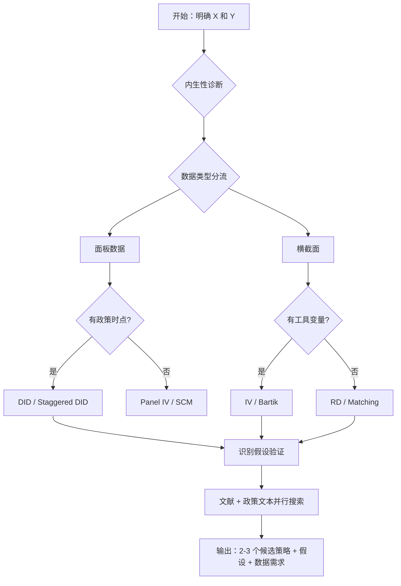
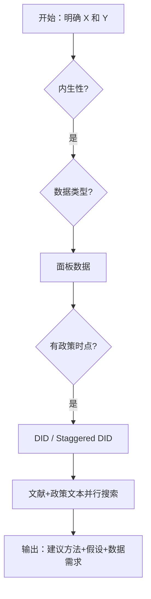

<!-- _class: lead -->
# Agent、OpenCode 与实证研究

## AI 辅助研究的完整工作流

**司继春**

上海对外经贸大学

---

## 今日路线

1. **Agent 的概念**：Agent 是什么、大模型基础、从提示词到驾驭工程
2. **Agent 的使用**：MCP 与 Skill、OpenCode 安装、写 Skill、整理知识
3. **Agent 辅助数据采集**：爬虫原理与实战
4. **基于大模型的文本分析**：情绪分类、信息抽取
5. **Agent 辅助实证分析**：研究设计、Stata 基础、车牌拍卖、教育支出、数字经济
6. **Agent 辅助理论推导**：C-CAPM 推导与估计、互联网与贸易边际

---

<!-- _class: lead -->
# 一、Agent 的概念

---

## 什么是 Agent？

Agent（智能体）= 大语言模型 + **四大核心能力**

| 能力 | 说明 |
|------|------|
| **记忆** | 短期记忆（对话历史）+ 长期记忆（知识库、用户偏好） |
| **规划** | 将复杂任务拆解为可执行的子任务序列 |
| **推理** | 基于上下文进行逻辑推理和判断 |
| **工具使用** | 调用外部工具（文件操作、网络访问、代码执行等） |
| **行动** | 实际执行操作，而不仅是生成文本 |

### Agent 例子

- **deep-research**：做深度资料检索、交叉验证与研究综述
- **PPT制作Agent**：根据大纲快速生成 slides、结构图和讲稿草稿

> 关键：Agent 不是"更聪明的聊天机器人"，而是**能自主行动的数字助手**

---

## Agent 的具象化：NanoBot

我的**NanoBot🐈**能做什么？

- 📊 **整理付款记录**：自动识别收据、发票，整理成表格
- 🎞️ **记录胶片**：自动归档、标注、检索影像资料
- 📚 **记录学术文章**：自动提取元数据、生成摘要、构建知识库
- 🔍 **做文献调研**：搜索、阅读、总结、生成综述报告
- 📈 **做监控**：定时抓取数据、生成报告、异常告警

> **演示时间**：现场展示 NanoBot 的实际操作

---

## Agent 的基础：大模型

---

## 大模型的三种核心能力

### 1. 补全（Completion）

最基础的功能：给提示词，模型生成续写

```
用户："中国的首都是"
模型："北京"
```

### 2. 聊天（Chat）

需要维护对话上下文，通过"角色"区分发言者

---

## 聊天中的角色系统

```
{
  "messages": [
    {"role": "system", "content": "你是一个 helpful 的助手"},
    {"role": "user", "content": "你好"},
    {"role": "assistant", "content": "你好！有什么可以帮你的？"},
    {"role": "user", "content": "今天天气怎么样？"}
  ]
}
```

| 角色 | 作用 |
|------|------|
| **system** | 设置助手行为、背景信息 |
| **user** | 用户的提示词 |
| **assistant** | 模型的历史回复 |
| **tool** | 工具调用的结果 |

---

## 3. 工具调用（Tool Calls）

模型根据工具描述，LLM**自主决定**调用哪些工具

```python
# 模型输出的工具调用指令
{
  "tool_calls": [{
    "function": {
      "name": "read_file",
      "arguments": {"path": "/home/user/data.csv"}
    }
  }]
}
```

**NanoBot 中的工具**：
- 文件读写、网络访问、系统命令执行
- 任务调度（cron）

---

## Agent 的重要工具：命令行执行

Agent 的强大之处在于能直接调用系统命令，完成文件操作、信息检索、环境检查等任务。

| 命令 | 用途 |
|------|------|
| `grep` | 在文本中搜索匹配内容 |
| `cat` | 查看文件内容 |
| `find` | 查找文件或目录 |
| `cp` / `mv` / `rm` | 复制、移动、删除文件 |
| `mkdir` | 创建目录 |
| `pwd` | 显示当前路径 |

### 跨平台提示

- **Linux / macOS**：上述命令通常已预装，开箱即用
- **Windows**：命令名称和用法不同，有时效率较低
  - 可用 `winget install Microsoft.coreutils` 安装与 *nix 一致的命令行包

---


## Temperature：控制输出的随机性

| Temperature | 效果 | 适用场景 |
|-------------|------|----------|
| **0.0 - 0.2** | 确定性高，输出稳定 | 代码生成、数据分析 |
| **0.3 - 0.5** | 平衡，有一定创造性 | 一般任务、写作 |
| **0.6 - 1.0** | 创造性高，多样性大 | 头脑风暴、创意写作 |

```python
# 示例：根据任务调整 temperature
- 代码生成：temperature=0.1
- 文献综述：temperature=0.3
- 头脑风暴：temperature=0.7
```

---

## 从提示词工程到驾驭工程



---

## 提示词工程（Prompt Engineering）

**核心策略**：让模型"听懂"你的需求

### 常见技巧

1. **明确角色**："你是一位经济学教授"
2. **明确任务**："请解释 DID 方法的识别假设"
3. **明确决策**："如果数据不满足平行趋势，请告诉我"
4. **零样本提示**：直接描述任务，不给示例
5. **少样本学习**：提供 1-3 个示例，让模型模仿
6. **格式化输出**：要求 JSON、Markdown 等结构化输出
7. **重复提示**：关键要求重复 2-3 次

---

## 上下文工程（Context Engineering）

**从"写好一句话"到"构建完整上下文"**

上下文工程 = 动态构建系统，以合适格式提供正确信息

### 核心组成（7 个部分）

1. **系统提示词**：定义模型整体行为
2. **用户提示词**：即时任务
3. **对话历史**：短期记忆
4. **长期记忆**：用户偏好、项目摘要
5. **检索信息（RAG）**：外部知识
6. **可用工具**：函数定义
7. **结构化输出**：输出格式要求

---

## 上下文工程的 4R 策略

| 策略 | 含义 | 应用场景 |
|------|------|----------|
| **Offload**（卸载） | 将信息保存到外部存储 | 长期记忆、任务计划 |
| **Retrieve**（检索） | RAG 动态检索相关信息 | 知识库、代码搜索 |
| **Reduce**（压缩） | 裁剪冗余信息 | 摘要生成、语义压缩 |
| **Isolate**（隔离） | 分而治之，SubAgent 处理 | 多 Agent 协作 |

> 参考：https://mp.weixin.qq.com/s/KbviOJ6q-K4ik_wzsUs2dw

---

## 驾驭工程（Harness Engineering）

**从"写好提示词"到"构建完整系统"**

Agent Harness = 包裹 LLM 的完整软件基础设施

### 生产级 Harness 的核心组件

1. **编排循环**：思考-行动-观察（ReAct）
2. **工具系统**：注册、验证、执行、结果捕获
3. **记忆系统**：短期/中期/长期三级架构
4. **上下文管理**：压缩、检索、隔离策略
5. **错误处理**：重试、降级、人工介入
6. **验证循环**：测试、检查、自我修正
7. **权限控制**：工具调用审批、安全护栏

> 参考：https://mp.weixin.qq.com/s/H8_U4vENXJuiojXtXbCF5w

---

<!-- _class: lead -->
# 二、Agent 的使用：MCP、Skill 与知识管理

---

## MCP：模型上下文协议

**MCP = AI 世界的"USB-C 接口"**

Anthropic 提出的开放标准，解决 AI 与外部工具的连接碎片化问题

### 核心架构

```
Host（宿主应用）
  └── Client（协议处理器）
        └── Server（外部服务适配层）
              └── 外部服务（数据库、API、文件系统）
```

**三种核心抽象**：
- **Tools**（操作）：执行函数
- **Resources**（数据）：提供数据访问
- **Prompts**（交互）：预配置工作流

> 参考：https://mp.weixin.qq.com/s/Ei9KOoOFgmvR0PsBVlMk-Q

---

## MCP 的工作流程

```
1. 初始化：Host 连接到 MCP Server
2. 能力发现：Server 注册可用工具列表
3. 决策与调用：模型选择并调用工具
4. 执行与返回：Server 执行操作，返回结果
5. 整合响应：模型生成最终回答
```

### MCP 的价值

- **标准化**：M×N 复杂度 → M+N 复杂度
- **跨平台**：任何 MCP Server 可被任何 Host 使用
- **即插即用**：像 USB 设备一样连接外部能力

---

## OpenCode 中的 MCP 配置

```json
{
  "mcp": {
    "context7": {
      "type": "remote",
      "url": "https://mcp.context7.com/mcp"
    },
    "gh_grep": {
      "type": "remote",
      "url": "https://mcp.grep.app"
    }
  }
}
```

---

## 常用 MCP 服务
- **Context7**：搜索官方文档
- **Grep.app**：GitHub 代码搜索
- **Sentry**：错误追踪
- **GitHub**：代码仓库操作

> 更多 MCP 服务与 Skill 可前往 [ModelScope](https://www.modelscope.cn/home) 下载

---

## Skill：AI 的"专业技能包"

**Skill = 给 AI 准备的"标准化工作交接包"**

### 三层渐进式加载机制

| 层级 | 内容 | 加载时机 | Token 成本 |
|------|------|----------|------------|
| **Level 1** | 元数据（名称、描述） | Agent 启动时 | 极低（~100 tokens） |
| **Level 2** | 指令文档（SKILL.md） | 任务匹配时 | 可控（<5k tokens） |
| **Level 3** | 资源与工具（脚本、参考） | 执行过程中 | 按需读取 |

> 参考：https://mp.weixin.qq.com/s/Ei9KOoOFgmvR0PsBVlMk-Q

---

## Skill 示例展示

### 1. economical-writing Skill

```yaml
---
name: economical-writing
description: "Economics research paper writing guide. 
  Trigger: 'write paper', 'polish writing', 'check style'"
---

## Core Principles
- Clarity: Every sentence clear on first reading
- Conciseness: Remove 20% of words from first draft
- Audience Awareness: Define implied reader explicitly

## Sentence-Level Rules
- Use active verbs (not "attempts" but "attempted")
- Keep subjects short (≤10 words)
- Old info first, new info last
- Avoid nominalizations (-tion, -ment, -ence)
- Blacklist: concept, situation, very, obviously
```

---


## Skill 示例展示（续）

### 2. 胶片记录 Skill

让Agent自己写skill

### 3. 股票价格监控 Skill

定时抓取股价数据

### 4. 整理付款记录 Skill（多模态）

- 识别收据、发票图片
- 提取金额、日期
- 整理成结构化表格

> **演示**：现场展示上述 Skill 的代码与操作

---

## MCP vs Skill：核心区别

| 维度 | **Skill** | **MCP Server** |
|------|-----------|----------------|
| **本质** | 指令和流程 | 数据和工具接口 |
| **Token 效率** | 极高（渐进式加载） | 较低（常见膨胀问题） |
| **开发难度** | 低（Markdown 配置） | 中高（完整应用开发） |
| **可移植性** | Claude/OpenCode 生态 | 跨平台通用标准 |
| **适用场景** | 重复性任务和流程 | 外部系统集成 |

---

## 黄金组合模式

### 模式一：Skill + MCP

```
用户：/code-review PR-123
  ↓
Skill 加载审查流程
  ↓
调用 GitHub MCP 获取代码变更
  ↓
执行审查逻辑
  ↓
通过 GitHub MCP 提交评论
```

### 模式二：Subagent + MCP

安全分析 Subagent → 调用漏洞数据库 MCP → 生成安全报告

> **关键原则**：Skill 教 AI "怎么做"，MCP 给 AI "用什么做"

> 参考：https://mp.weixin.qq.com/s/foQhK0YzBUJi1UtQ8o6G-w

---

## OpenCode 的安装与使用

---

## OpenCode 简介

**开源的 AI 编码代理**，提供多种使用方式：
- 终端界面（TUI）
- 桌面应用
- IDE 扩展

### 安装方式

```bash
# 推荐：使用安装脚本（Linux）
curl -fsSL https://opencode.ai/install | bash

# 或使用 npm
npm install -g opencode-ai

# macOS/Linux 使用 Homebrew
brew install anomalyco/tap/opencode
```

> 官方文档：https://opencode.ai/docs/zh-cn/

---

## 初始化与配置

```bash
# 进入项目目录
cd /path/to/project

# 启动 OpenCode
opencode

# 初始化项目（创建 AGENTS.md）
/init
```

### 配置 API 密钥

```bash
# 连接提供商
/connect

# 或手动配置 opencode.json
{
  "provider": "openai",
  "apiKey": "your-api-key"
}
```

---

## 为 OpenCode 扩展能力 —— 插件

### Oh-my-opencode

**OpenCode 插件**，提供：
- **异步子代理**：并行运行多个 Agent
- **精选 Agent**：Sisyphus（主编排）、Prometheus（规划）、Hephaestus（深度执行）
- **LSP/AST 工具**：重构、诊断
- **内置 MCP**：Exa（搜索）、Context7（文档）、Grep.app（GitHub 搜索）
- **Claude Code 兼容层**

安装：`npm install -g oh-my-opencode`（最佳实践：让**OpenCode**帮你装）

### Superpower

另一款 OpenCode 扩展插件

> https://github.com/opensoft/oh-my-opencode

---

## Oh-my-opencode 的核心 Agent

| Agent | 模型（示例） | 职责 |
|-------|------|------|
| **Sisyphus** | Opus 4.5 High | 主代理，编排所有任务 |
| **Prometheus** | Opus / Kimi / GLM | 战略规划代理；先访谈需求、识别范围与歧义，再生成详细计划 |
| **Atlas** | - | 计划执行代理（Plan Executor）；负责把既定计划推进为实际工作流 |
| **Hephaestus** | GPT-5.5 | 自主深度执行代理；更偏深度落实与端到端执行，是“给目标、自己做完”的工匠型代理 |
| **Oracle** | GPT 5.2 Medium | 架构设计、深度调试 |
| **Frontend** | Gemini 3 Pro | 前端开发 |
| **Librarian** | Claude Sonnet 4.5 | 官方文档、开源实现搜索 |
| **Explore** | Grok Code | 快速代码库探索 |

**魔法关键词**：在提示词中加入 `ultrawork` 或 `ulw`，自动启用全部高级功能

---

## 常用命令

| 命令 | 功能 | 快捷键 |
|------|------|--------|
| `/connect` | 配置 API 密钥 | - |
| `/init` | 创建/更新 AGENTS.md | `Ctrl+x i` |
| `/models` | 列出可用模型 | `Ctrl+x m` |
| `/new` | 开始新会话 | `Ctrl+x n` |
| `/export` | 导出对话为 Markdown | `Ctrl+x x` |
| `/undo` | 撤销最后修改 | `Ctrl+x u` |
| `/redo` | 重做撤销的操作 | `Ctrl+x r` |
| `/compact` | 压缩当前会话 | `Ctrl+x c` |
| `/exit` | 退出OpenCode | `Ctrl+d` |
| `/session` | 切换会话 | - |

---

## AGENTS.md 的作用

**AGENTS.md = 项目的"使用说明书"**

OpenCode 通过 `/init` 自动分析项目并生成 AGENTS.md（CLAUDE.md）

### 内容示例

```markdown
# 项目规范

## 技术栈
- React + TypeScript
- Tailwind CSS
- Node.js

## 代码规范
- 使用函数组件
- 类型定义放在 types/ 目录
- 测试文件与源文件同名

## 常用命令
- `npm run dev`：启动开发服务器
- `npm test`：运行测试
```

---

## AGENTS.md 的作用

- 让 Agent 了解项目结构和规范
- 保持团队一致的代码风格
- 可以手动编辑，也可以让 Agent 自动更新
- 小规模项目也可以不用
- 对大规模项目非常重要

---

## 重要工具：Git 版本控制

**使用 Agent 写代码，强烈建议配合 Git 进行版本控制。**

### 为什么需要 Git？

- Agent 可能会改错，**回退到之前的版本**是最快、最安全的修复方式
- 在不同版本之间**对比差异**，可以帮助理解 Agent 改了什么、改得对不对
- 保留修改历史，方便追踪整个开发过程

### 各平台推荐方案

| 平台 | 推荐工具 | 说明 |
|------|----------|------|
| **Linux** | `git`（命令行） | 通常已预装，开箱即用 |
| **macOS** | `git`（命令行） | `Xcode Command Line Tools` 自带 |
| **Windows** | **GitHub Desktop** / **UGit**(新手推荐，有命令行) | 图形化界面，适合不习惯命令行的用户 |

### 使用方式

你可以直接让 OpenCode 操作 Git：

```bash
# 初始化仓库
git init

# 提交一个版本
git add -A && git commit -m "初始版本"

# 回退到某个版本
git checkout <commit-id>
```

或者在对话中直接说：**"帮我把当前改动提交一个 commit"**、**"帮我回退到上一个版本"**。

> **建议**：在每次让 Agent 做一个大改动之前，先 commit 一个版本，这样即使改坏了也能轻松回退。

---

## Coding Agent 的工作流：计划与执行


```
制定计划 → 审查计划 → 执行修改 → 验证结果 → 迭代优化
```
---

## Coding Agent 的工作流：计划与执行

### 计划模式（Plan Mode / Prometheus）

```bash
# 按 Tab 切换到计划模式
<TAB>

# 描述需求
"添加用户删除功能：软删除 + 回收站页面"

# Agent 生成实施计划，不修改任何文件
```

### 构建模式（Build Mode / Atlas）

```bash
# 再次按 Tab 切换回构建模式
<TAB>

# 确认计划后执行
"Sounds good! Go ahead and make the changes."

# 或者在Oh-My-Openagent中：/start-workd
```


---

## 实战：让 OpenCode 写 Skill

---

## 案例：economical-writing Skill

### 起源：将一本书炼化成 Skill

**经济学论文写作书籍** → **economical-writing Skill**

### 开发历程

1. **阅读与提炼**：通读全书，提取核心原则
2. **结构化**：将内容组织为 SKILL.md 格式
3. **编写 frontmatter**

```yaml
---
name: economical-writing
description: Economics research paper writing guide with clear, concise, and persuasive writing principles.
version: 1.0
---
```

4. **内容模块化**：核心原则、句子风格、段落结构、论文结构、常见错误
5. **测试与迭代**：在实际写作中测试，根据效果调整

---

## Skill 开发的最佳实践

### 1. 从实际问题出发

- 不是"写一个 Skill"，而是"解决一个重复性任务"

### 2. 渐进式加载设计

- 元数据 → 指令 → 资源，分层加载

### 3. 具体示例优于抽象描述

- 提供具体的输入输出示例

### 4. 持续迭代

- 在实际使用中不断优化

### 5. 文档化触发词

```yaml
description: "Trigger: 'extract knowledge', 'build wiki', 'summarize papers'"
```

---

## 案例：多 Skill 协作——经济学文本分析文献综述

### 来源

`文献综述/` 文件夹收录了一个完整案例：基于 **35 篇 PDF 文献**，撰写聚焦经济学中文本分析方法的综述，特别关注大语言模型的应用。

### 使用的 Skill

| Skill | 作用 |
|-------|------|
| **knowledge-extraction** | PDF → Markdown 转换、Wiki 结构化摘要、主索引 |
| **literature-review** | 按方法分类组织综述，从简单到复杂 |
| **economical-writing** | 润色学术表达，提升写作质量 |

> **核心启示**：复杂研究任务往往需要多个 Skill 协同，而不是单个 Skill 单打独斗。

---

## 多 Skill 协作的工作流程

```
35 篇 PDF
    ↓  marker-pdf
Markdown 文件
    ↓  knowledge-extraction
Wiki/ 结构化摘要 + Index.md
    ↓  literature-review
按方法分类的综述大纲
    ↓  literature-review + economical-writing
Output/LiteratureReview.md
```

### 方法分类结构

| 层级 | 代表方法 | 代表文献 |
|------|----------|----------|
| 词典法 | 关键词词频统计 | Baker et al. (2016) EPU 指数 |
| 机器学习 | SVM、RF、文本分类 | 金融情绪混合测度 |
| 深度学习 | BERT / FinBERT 微调 | FinBERT、劳动节约型专利识别 |
| 大语言模型 | GPT / ERNIE 零样本/微调 | 方明月等（2024）数字化转型测度 |

---

## 案例的输出与价值

### 输出文件

| 文件 | 内容 |
|------|------|
| `Raw/*/*.md` | 35 篇文献的 Markdown 转换 |
| `Wiki/*.md` | 每篇文献的结构化摘要 |
| `Wiki/Index.md` | 主索引，含自定义维度（方法类型、应用领域、数据来源、模型/工具） |
| `Output/LiteratureReview.md` | 最终约 3000 字的中文文献综述 |

### 关键经验

1. **Skill 组合 > 单一 Skill**：提取、综述、写作三类能力分工明确
2. **索引维度要自定义**：根据"文本分析方法"这一综述目的，额外添加方法类型、数据来源等列
3. **人机协作**：Agent 负责批量转换与摘要，研究者把控方法分类与最终评价
4. **可复用**：同样的流程可迁移到其他领域的文献综述

---

## 实战：让 OpenCode 整理知识

---

## 案例：knowledge-extraction Skill

### 功能：从 PDF 到结构化知识库

```
PDF 文献 → Markdown 转换 → 结构化摘要 → 主索引
```

### 技术栈

- **marker-pdf**：PDF 转 Markdown（保留格式和元数据）
  - 备选：**PyMuPDF**
- **pandoc**：文档格式转换
- **OpenCode Agent**：自动执行提取和整理

---

## knowledge-extraction 的工作流程

### Phase 1：PDF 到 Markdown 转换

```bash
# 安装 marker-pdf
pip install marker-pdf

# 批量转换
marker Raw/
```

**要求**：每个 PDF 对应一个 Markdown 文件，保留原始结构

### Phase 2：摘要与索引构建

1. 读取每个 Markdown 文件
2. 提取元数据：标题、作者、年份、期刊
3. 生成结构化摘要：主要观点、研究方法、数据发现、结论
4. 创建 Wiki/Index.md 主索引

---

## 输出示例：Wiki 摘要

```markdown
# 论文标题

## 基本信息
- **作者**: ...
- **年份**: ...
- **期刊/会议**: ...

## 主要观点
...

## 研究方法
...

## 主要数据与发现
...

## 结论
...

## 与用户意图的关联
...
```

---

### 主索引 Index.md

| 序号 | 题目 | 作者 | 年份 | 期刊/会议 | 主要观点 | 研究方法 | 主要数据 | 结论 | 文本分析方法类型 | 应用领域 | 文本数据来源 | 使用的模型/工具 |
|------|------|------|------|-----------|----------|----------|----------|------|------------------|----------|--------------|----------------|
| 1 | [EmoLLMs: A Series of Emotional Large Language Models and Annotation Tools for Comprehensive Affective Analysis](EmoLLMs%20A%20Series%20of%20Emotional%20Large%20Language%20Models%20and%20Annotation%20Tools%20for%20Comprehensive%20Affective%20Analysis.md) | Zhiwei Liu 等 | 2024 | KDD '24 | 首个面向综合情感分析的开源指令微调LLM系列EmoLLMs，支持分类与强度回归多任务，超越ChatGPT/GPT-4 | LLM指令微调（多任务情感分析）；构建234K指令数据集AAID和14数据集评估基准AEB | AAID 234K样本；AEB 14个情感数据集（Twitter等多平台） | 综合情感分析需同时处理分类与回归任务；EmoLLMs可有效替代GPT-4进行情感标注 | 大语言模型指令微调、多任务情感分析（分类+回归） | 情感分析、情绪检测、NLP工具开发 | Twitter推文（SemEval-2018 Task 1）；多平台情感数据集 | EmoLLMs（基于LLaMA微调）；ChatGPT、GPT-4、Flan-T5、VADER、TextBlob |

---

## 重要工具：文档转换

### marker-pdf

- **功能**：将 PDF 转换为 Markdown
- **优势**：保留格式、提取元数据、处理复杂排版
- **安装**：`pip install marker-pdf`

### pandoc

- **功能**：万能文档转换器
- **支持格式**：PDF、Word、HTML、Markdown、LaTeX 等
- **安装**：`brew install pandoc` 或 `apt-get install pandoc`

### 使用场景

- 批量转换下载的文献 PDF
- 将旧文档迁移到 Markdown
- 生成多种格式的输出

---

## literature-review Skill：系统化文献综述工作流

### 它是什么

`literature-review` Skill 封装了从文献搜索到最终综述的**完整四阶段工作流**。它不是简单的"帮我搜文献"，而是一个结构化、可复现的学术研究管道，确保每一步都在研究者控制之下。

### 四阶段工作流

| 阶段 | 名称 | 产出 | 关键设计 |
|------|------|------|---------|
| **Phase 0** | 文献搜索与发现 | 文献清单 + PDF | 委托 `literature-search` Skill 处理全部搜索；支持从已有参考文献拓展、关键词搜索、直接使用已有文献三种模式 |
| **Phase 0.5** | 文献确认 | 确认后的文献集 | **制作 Wiki 前与用户确认清单**，避免遗漏或冗余——这是 Human-in-the-Loop 的关键节点 |
| **Phase 1** | 知识提取 | Wiki 摘要 + Index.md | 委托 `knowledge-extraction` Skill 完成 PDF→Markdown→结构化摘要→主索引 |
| **Phase 2** | BibTeX 下载（可选） | `.bib` 引用文件 | 按标题搜索 Google Scholar，下载 BibTeX |
| **Phase 3** | 综述撰写 | `LiteratureReview.md` | **先确认大纲 → 再综合撰写 → 参考文献交叉校验** |

### 核心设计原则

1. **先确认，再执行**：每个阶段结束都向用户确认，避免方向性错误——尤其是 Phase 0.5（文献清单确认）和 Phase 3（大纲确认）
2. **综合而非罗列**：综述按主题综合多篇文献观点，而非逐篇摘要堆砌——这是好的文献综述与"文献流水账"的核心区别
3. **相关性优先于期刊质量**：一篇核心期刊但高度相关的论文 > 顶级期刊但边缘相关的论文；不强写不相关文献
4. **多 Skill 协作**：文献搜索 → `literature-search`，知识提取 → `knowledge-extraction`，写作润色 → `economical-writing`
5. **中文统一输出**：所有摘要、索引、综述均使用中文撰写，降低中文研究者的阅读和写作门槛

### 参考文献的严格检查

综述完成后自动执行：
- 提取正文所有引用 → 提取参考文献列表 → 交叉比对
- 正文引用但缺参考文献 → **报错并补充**
- 参考文献列出但正文未引用 → **报告并移除**
- 排序检查：按作者姓氏首字母（中文按拼音）升序

### 与其他 Skill 的关系

```
literature-search（文献搜索+下载）
    ↓
literature-review（综述工作流编排）
    ├── 调用 knowledge-extraction（PDF→Wiki）
    ├── 调用 literature-search（BibTeX下载）
    └── 调用 economical-writing（写作润色）
    ↓
Output/LiteratureReview.md
```

> **核心价值**：将文献综述从"手工翻论文 + 逐篇笔记"转变为可复现的标准化管道流程。不是 AI 替你做综述，而是 AI 帮你把综述做得更系统、更完整。

---

<!-- _class: lead -->
# 三、Agent 辅助数据采集

---

## 什么是网络爬虫？

**网络爬虫** = 自动从网页上抓取数据的程序

### 基本原理

1. **发送请求**：模拟浏览器向服务器发送 HTTP 请求
2. **获取响应**：服务器返回 HTML、JSON 等页面内容
3. **解析提取**：从页面中定位并提取目标数据
4. **存储使用**：将数据保存到数据库或文件中

> 爬虫本质上是用代码自动化"访问网页 → 复制信息"的过程

---

## 爬虫涉及的核心技术

| 技术 | 作用 |
|------|------|
| **HTTP 协议** | 理解请求方法、状态码、Headers、Cookies |
| **HTML 语言** | 解析网页结构，定位目标元素 |
| **JavaScript** | 处理动态加载、加密参数、前端逻辑 |
| **正则表达式** | 从文本中快速抽取特定模式 |
| **数据库技术** | 持久化存储、去重、索引与查询 |

---

## 一个爬虫的常见流程

```
分析网站架构 → 通过 HTTP 获取网页 → 从网页中提取信息 → 数据简单清洗 → 放入数据库
```

### 关键步骤说明

1. **分析网站架构**：观察 URL 规律、分页方式、数据接口
2. **获取网页**：使用 `requests`、`httpx` 等库发送请求
3. **提取信息**：使用 `BeautifulSoup`、`lxml`、`正则` 解析
4. **数据清洗**：统一格式、处理缺失值、去重
5. **存储入库**：写入 SQLite、MySQL、CSV 等

---

## 两种请求方式：直接请求 vs 模拟浏览器

### 方式一：直接发送 HTTP 请求

- 使用 Python 的 `requests`、`httpx`
- 速度快、开销小
- 适合静态页面或开放 API

### 方式二：模拟真实浏览器点击

- 使用 `Playwright`、`Selenium`
- 直接操控浏览器执行 JS、点击按钮、滚动页面
- 适合动态渲染、反爬严格的网站

> **原则**：能用简单请求解决，就不用浏览器；必要时再用 Playwright

---

## 爬虫的细节：反爬与应对

### 常见反爬虫策略

| 反爬手段 | 说明 | 常见应对 |
|----------|------|----------|
| **IP 封禁/限速** | 同一 IP 请求过频 | 代理服务器、降低频率 |
| **验证码** | 人机验证 | 打码平台、跳过非必要页面 |
| **动态加载** | 数据由 JS 异步请求 | 分析接口、使用 Playwright |
| **请求头校验** | 检查 User-Agent、Referer | 伪装请求头 |
| **Cookie/Token** | 需要登录态 | 模拟登录、维护 Session |
| **字体/图片混淆** | 关键信息被特殊编码 | OCR、解析字体文件 |

---

## 爬虫的细节：代理与数据库设计

### 代理服务器

- **作用**：隐藏真实 IP、分散请求来源、绕过地域限制
- **类型**：HTTP 代理、SOCKS 代理、住宅代理、数据中心代理
- **注意**：代理的质量和稳定性直接影响爬取成功率

### 数据库设计要点

- **去重机制**：用 URL 哈希或主键避免重复爬取
- **索引优化**：按时间、来源、关键词建立索引
- **状态追踪**：记录"待爬取 / 已爬取 / 失败"状态
- **增量更新**：只抓取新增或变更的内容

---

## 爬虫的开发流程

```
探索网站结构 → 写 HTTP 请求 → 写 HTML 解析 → 设计数据库 → 测试 → 维护
```

### 每个阶段 Agent 都能参与

1. **探索结构**：让 Agent 用 Playwright 翻页、查看源码
2. **设计请求**：自动生成 headers、参数、重试逻辑
3. **编写解析**：生成 BeautifulSoup / 正则提取代码
4. **设计数据库**：给出表结构和 SQL
5. **测试迭代**：自动运行、捕获异常、修正代码

---

## Agent 能为我们做什么？

**几乎覆盖爬虫开发的全流程**

| 阶段 | Agent 的工作 |
|------|--------------|
| **探索网站结构** | 用 Playwright 模拟点击，分析网页结构 |
| **设计 HTTP 请求** | 构造 URL、Headers、Cookies、重试策略 |
| **处理反爬** | 探索代理、请求间隔、浏览器指纹等方案 |
| **解析 HTML** | 生成 BeautifulSoup、正则、XPath 提取代码 |
| **设计数据库** | 设计表结构，写好 SQL 建表语句 |
| **测试与迭代** | 运行脚本、捕获异常、持续优化 |

> **核心优势**：把"查文档、试代码"的重复劳动交给 Agent

---

## 实例一：海底光缆数据爬取

### 案例特点

- 数据来源：`https://www.submarinecablemap.com`
- 结构清晰，直接请求即可获得 JSON 数据
- 无需处理复杂反爬

### 用户原始提示词

> 请写一个 Python 脚本爬取 https://www.submarinecablemap.com 的海底光缆数据。注意：
> 1. 所有数据保存为 CSV 格式，附带变量说明
> 2. 使用代理 `192.168.5.9:7890`
> 3. 每次获取一条光缆数据后，停十几秒再请求，防反爬
> 4. 必须包含开通时间、经过的国家和城市等信息

---

## 实例一：Agent 的探索过程

### 从简单请求到浏览器网络监控

1. **先尝试 `webfetch` 直接抓页面** → 失败（SPA，需要 JS 渲染）
2. **改用 Playwright 打开网页**，查看网络请求
3. **发现关键 API 端点**：
   - `/api/v3/config.json`
   - `/api/v3/search.json`（光缆索引）
   - `/api/v3/cable/cable-geo.json`
   - `/api/v3/landing-point/landing-point-geo.json`
4. **进一步试出单条光缆详情接口**：
   ```
   /api/v3/cable/{cable_id}.json
   ```

> **启示**：Agent 能自动完成"探测页面 → 发现接口 → 验证数据"的探索流程

---

## 实例一：使用的 API 与字段

### 核心 API

| API | 作用 |
|-----|------|
| `/api/v3/search.json` | 获取所有光缆与登陆点的索引列表 |
| `/api/v3/cable/{id}.json` | 获取单条光缆的完整详情 |

### 单条光缆返回的字段

```json
{
  "id": "2africa",
  "name": "2Africa",
  "length": "45,000 km",
  "landing_points": [{"id", "name", "country", "is_tbd"}, ...],
  "owners": "Bayobab, China Mobile, Meta, ...",
  "suppliers": "ASN",
  "rfs": "2024",
  "rfs_year": 2024,
  "is_planned": false,
  "url": "https://www.2africacable.net/",
  "notes": null
}
```

---

## 实例一：反爬策略与代码实现

### 用户明确提出的反爬要求

- 使用代理：`192.168.5.9:7890`
- 每次请求间隔 **10-15 秒**（随机）

### 代码片段

```python
PROXIES = {
    "http": "http://192.168.5.9:7890",
    "https": "http://192.168.5.9:7890"
}

MIN_DELAY = 10
MAX_DELAY = 15

for cable_id in cable_ids:
    response = requests.get(
        f"{BASE_URL}/api/v3/cable/{cable_id}.json",
        proxies=PROXIES,
        timeout=30
    )
    # 处理数据 ...
    time.sleep(random.uniform(MIN_DELAY, MAX_DELAY))
```

---

## 实例一：数据结构与输出

### 输出文件

| 文件 | 格式 | 说明 |
|------|------|------|
| `submarine_cables.csv` | CSV | 每行一个"光缆-登陆点"组合 |
| `submarine_cables_raw.json` | JSON | 每条光缆的完整原始数据 |
| `variables_description.txt` | 文本 | 字段说明文档 |

### CSV 字段

```
cable_id, cable_name, length_km, rfs, rfs_year, is_planned,
owners, suppliers, landing_points_count, landing_point_id,
city, country, is_tbd, url, notes
```

### 示例行（2Africa 光缆）

```
2africa,2Africa,"45,000 km",2024,2024,False,
"Bayobab, China Mobile, Meta, Orange, ...",ASN,50,
luanda-angola,"Luanda, Angola",Angola,False,
https://www.2africacable.net/,
```

---

## 实例一：爬取结果统计

### 最终成果

| 指标 | 数值 |
|------|------|
| 目标光缆总数 | 693 条 |
| 成功爬取 | **692 条**（1 条因连接中断失败） |
| CSV 总行数 | **3150 行** |
| 涉及国家数 | **186 个** |
| 有 RFS（开通时间）数据的行数 | 3121 / 3150 |
| 运行时长 | 约 2-3 小时 |

### 关键经验

- **明确任务描述**（字段、格式、代理、延迟）能显著提升代码可用性
- **让 Agent 先探索网站结构**，比直接猜测 API 更高效
- **保留原始 JSON**，便于后续校验和补充分析
- **CSV 按登陆点展开**，方便按国家/城市做分组统计

---

## 实例二：巨潮网上市公司公告

### 案例特点

- **需要实时更新**：每日新增公告
- **需要下载 PDF**：公告原文为 PDF 格式
- **需要解析 PDF**：提取公告标题、发布日期、正文内容
- **需要持久化**：用 SQLite 存储结构化元数据与文本内容

### 用户提示词（节选）

> 网址 `https://www.cninfo.com.cn/new/commonUrl/pageOfSearch?url=disclosure/list/search` 中是巨潮资讯网公开上市公司公告的列表页，现在需要实时爬取上市公司公告。
>
> 1. 探索以上网站的网络结构，处理包括翻页等细节，写好定时爬取该网页的功能。
> 2. 探索每条公告详情页中提取 PDF 文件链接的方法。
> 3. 定时更新列表页，检查是否有新的公告；如果有新的公告，爬取其中的 PDF。
> 4. PDF 文件需要解析为 txt 文件。使用 `marker` 或其他包转换 pdf。
> 5. 设计一个数据库（先简单使用 `sqlite`），需要包括公告的上市公司代码、名称、公告标题、公告内容等信息。
> 6. 将转换好的 pdf 信息写入到数据库中。
> 7. 使用多线程：更新列表和获取 PDF 使用不同的线程。
> 8. 保留好反爬用的代理服务器的接口。

---

## 实例二：Agent 的探索与发现

### 关键发现

- 列表页是 **SPA（单页应用）**，真实数据来自后台 **POST API**：
  - `https://www.cninfo.com.cn/new/hisAnnouncement/query`
- 翻页通过 `pageNum` / `pageSize` 参数实现
- **PDF 链接无需进入详情页抓取**：列表 API 直接返回 `adjunctUrl`
- PDF 完整 URL 通过静态域名拼接：
  - `https://static.cninfo.com.cn/{adjunctUrl}`

### 请求要点

| 项目 | 内容 |
|------|------|
| 方法 | `POST` |
| 参数 | `pageNum`, `pageSize`, `tabName=fulltext`, `column=sse`, `category=category_szsh_all` |
| 请求头 | `X-Requested-With: XMLHttpRequest`、`Referer`、`User-Agent` |

---

## 实例二：数据库设计（实际实现）

### `announcements` 表

| 字段 | 类型 | 说明 |
|------|------|------|
| `id` | INTEGER PRIMARY KEY AUTOINCREMENT | 自增主键 |
| `announcement_id` | TEXT UNIQUE NOT NULL | 公告唯一 ID |
| `stock_code` | TEXT NOT NULL | 股票代码 |
| `stock_name` | TEXT | 公司名称 |
| `org_id` | TEXT | 机构 ID |
| `title` | TEXT NOT NULL | 公告标题 |
| `announcement_time` | INTEGER | 公告时间戳（毫秒） |
| `announcement_time_str` | TEXT | 格式化时间字符串 |
| `adjunct_url` | TEXT | 附件相对路径 |
| `pdf_url` | TEXT | 完整 PDF 链接 |
| `pdf_path` | TEXT | 本地 PDF 保存路径 |
| `txt_path` | TEXT | 本地 TXT 保存路径 |
| `content` | TEXT | PDF 解析后的正文 |
| `status` | TEXT DEFAULT 'pending' | pending / completed / failed |
| `created_at` | INTEGER NOT NULL | 入库时间戳 |
| `updated_at` | INTEGER NOT NULL | 更新时间戳 |

> **注意**：实际表结构与最初 slide 中的简化版不同，增加了 `announcement_id`、`stock_name`、`org_id`、`announcement_time`、`txt_path`、`content`、`created_at`、`updated_at` 等字段。

---

## 实例二：多线程调度架构

### `JuchaoScheduler` 设计

```text
┌─────────────────────────────────────────┐
│           JuchaoScheduler               │
│  ┌──────────────┐   ┌────────────────┐  │
│  │ 列表更新线程 │   │  PDF 获取线程  │  │
│  │ (60s 周期)   │   │  (30s 周期)    │  │
│  └──────┬───────┘   └────────┬───────┘  │
│         │                    │          │
│    update_announcement_list()  get_pending_announcements()
│         │                    │          │
│         ▼                    ▼          │
│      SQLite DB           ThreadPoolExecutor
│                              (max 3)    │
└─────────────────────────────────────────┘
```

- **列表线程**：定期拉取公告列表，根据 `announcement_id` 去重写入数据库
- **PDF 线程**：从数据库读取 `pending` 状态记录，用线程池并发下载并解析

---

## 实例二：PDF 下载与解析

### 流程

1. 从 `adjunct_url` 拼接完整 PDF URL：`https://static.cninfo.com.cn/{adjunctUrl}`
2. 使用 `httpx` + 重试机制下载 PDF，保存到 `data/pdfs/`
3. 使用 **PyMuPDF (`fitz`)** 提取文本，保存为 `data/txts/`
4. 将正文写入数据库 `content` 字段，状态更新为 `completed`

### 文件命名示例

```text
data/pdfs/000597_1225370066_2025年年度权益分派实施公告.pdf
data/txts/000597_1225370066_2025年年度权益分派实施公告.txt
```

### 关于 PDF 解析工具的选择

- 用户原要求使用 `marker`
- 实际实现使用 **PyMuPDF (`fitz`)**
- 原因：`marker` 依赖 PyTorch，体积庞大；当前实现已满足文本提取需求

---

## 实例二：反爬与代理

### 反爬策略

| 策略 | 实现 |
|------|------|
| User-Agent 伪装 | `Chrome 125` 完整 UA |
| 请求头模拟 | `X-Requested-With: XMLHttpRequest`、`Referer` |
| 重试机制 | 最多 3 次，退避延时 |
| 翻页延时 | 页间 `0.5s` 间隔 |
| 代理预留 | `config.HTTP_PROXY_URL` + `httpx.Client(proxy=...)` |

### 代理配置示例

```python
HTTP_PROXY_URL = "http://127.0.0.1:7890"
```

---

## 实例二：测试结果

### 集成测试结果

| 测试项 | 结果 |
|--------|------|
| `test_list_api_smoke` | PASSED |
| `test_pagination` | PASSED |
| `test_normalize_announcement` | PASSED |
| `test_build_pdf_url` | PASSED |
| `test_database_insert_and_query` | PASSED |
| `test_pdf_download_and_parse_smoke` | PASSED |
| `test_list_updater` | PASSED |
| `test_scheduler_run_once` | PASSED |
| `test_pdf_path_sanitization` | PASSED |

**9 passed in 1.35s**

### 端到端验证

```python
{'list_stats': {'total': 30, 'inserted': 30, 'updated': 0},
 'pdf_results': [
    {'id': '1225370066', 'success': True, 'error': ''},
    {'id': '1225370058', 'success': True, 'error': ''},
    ...
 ]}
```

---

## 实例二：关键经验

- **不要假设必须从详情页抓 PDF**：巨潮网的列表 API 已直接返回 `adjunctUrl`
- **数据库设计要比最初预期更完整**：需要 `announcement_id` 去重、多时间字段、PDF/TXT 路径、状态机
- **PDF 解析工具要权衡成本**：`marker` 精度高但依赖重，PyMuPDF 够用且轻量
- **多线程分工明确**：列表更新与 PDF 下载分离，PDF 下载内部再用线程池并发
- **反爬配置预留代理接口**：`HTTP_PROXY_URL` 可随网络环境灵活启用

---

<!-- _class: lead -->
# 四、基于大模型的文本分析

---

## 从“爬数据”到“读数据”

**爬虫解决的是“拿到文本”，LLM 解决的是“读懂文本”**

上市公司公告、新闻、研报、政策文件……
- 数量大：每天成百上千份
- 格式乱：PDF、网页、扫描件
- 信息隐含：情绪、事件、实体关系藏在自然语言里

### Agent 能做的文本分析任务

| 任务 | 输出 |
|------|------|
| **情绪分类** | 积极 / 消极 / 中性 |
| **事件抽取** | 减持、并购、分红、诉讼…… |
| **实体识别** | 股东名称、金额、比例、时间 |
| **关系提取** | 谁减持了哪家公司的多少股份 |

> **核心思路**：把 LLM 当成一个可批量调用的“文本分析师”

---

## 案例一：公告情绪分析

### 1. 用户提示词

来自 `session-senti.md` 的真实输入：

```text
读取TODO.md并执行
```

后续报错后追加：

```text
报错了，请修改
```

`TODO.md` 中的完整需求：

> 使用 ollama-python 构建情感分类框架；设计提示词关注股价影响，
> 分为“积极/消极/中性”；读取每个 txt；结果写入 sentiment.csv；
> 用 5 个模型分别跑，外层循环模型、内层循环文件；提示词单独写入 sentiment_prompt.md。

---

## 案例一：系统提示词设计

```markdown
# 中国上市公司公告情绪分析提示词

## 任务说明
你是一名专业的金融分析师。请分析以下上市公司公告内容，
判断该公告对公司股票价格的潜在影响，并将情绪分类为：
积极 / 消极 / 中性。

## 参考关键词
- 积极：分红、增持、回购、业绩增长、获得订单、并购重组、股权激励
- 消极：减持、亏损、退市风险、行政处罚、诉讼、债务危机、业绩下滑

## 输出要求
请仅输出以下三个标签中的一个，不要输出任何解释：
积极 / 消极 / 中性
```

> **技巧**：把“领域知识”写进提示词，比让模型自己猜更稳定

---

## 案例一：代码过程

### 数据来源

`/home/aragorn/Working/Agent课程/Juchao/data/txts/` 中的 60 份公告 TXT

文件名格式：`STOCKID_PUBID_TITLE.txt`

```text
000597_1225370066_2025年年度权益分派实施公告.txt
000949_1225372625_持股5_以上股东减持股份预披露公告.txt
```

### 核心流水线

```python
MODELS = [
    ("gemma3_31b", "gemma4:31b"),      # gemma3:31b 不可用，用 gemma4:31b 替代
    ("qwen3_5_35b", "qwen3.5:35b"),
    ("qwen3_5_9b", "qwen3.5:9b"),
    ("deepseek_r1_32b", "deepseek-r1:32b"),
    ("deepseek_r1_14b", "deepseek-r1:14b"),
]

# 外层循环：模型
# 内层循环：文件
for col_name, server_model in MODELS:
    for txt_file in sorted(DATA_DIR.glob("*.txt")):
        value, raw = call_model(client, server_model, prompt, text)
        # 解析 → 1 / -1 / 0，写入 checkpoint
```

### 工程细节

- **文本截断**：超过 6000 字符的公告只保留前 6000 字符
- **逐文件 checkpoint**：每处理完一份公告就保存 JSON，支持断点续跑
- **原子写 CSV**：先写 `.tmp` 再 rename，避免中间文件损坏
- **解析兜底**：模型输出异常时默认标为中性并记录日志

---

## 案例一：结果

`sentiment.csv`（部分）

| STOCKID | PUBID | TITLE | gemma3_31b | qwen3_5_35b | qwen3_5_9b | deepseek_r1_32b | deepseek_r1_14b |
|---------|-------|-------|------------|-------------|------------|-----------------|-----------------|
| 000597 | 1225370066 | 2025年年度权益分派实施公告 | 1 | 1 | 1 | 1 | 1 |
| 000949 | 1225372625 | 持股5_以上股东减持股份预披露公告 | -1 | -1 | -1 | -1 | -1 |
| 002475 | 1225369948 | 关于发行境外上市外资股_H股_获得中国证监会备案的公告 | 1 | 1 | 1 | 0 | 0 |
| 600525 | 1225372618 | 关于签署_合作框架协议_暨关联交易的公告 | 1 | 0 | 0 | 1 | -1 |

### 观察

- 多数公告五模型一致
- 部分模糊公告存在分歧，正好说明需要**人工校验**或**集成规则**

---

## 案例二：股东减持信息抽取

### 1. 用户提示词

来自 `session-extract.md` 的真实输入：

```text
读取@TODO_extrac.md 并执行
```

`TODO_extrac.md` 中的完整需求：

> 复用情绪分析代码；设计新提示词判断公告是否与股东减持有关，
> 提取减持份额；结果写入 stock_sell.csv；只保留相关公告；
> 不要影响已有项目运行，充分测试后再运行。

---

## 案例二：系统提示词设计

```markdown
## 任务说明
阅读以下上市公司公告，判断是否与股东减持股份有关。

## 提取字段
1. shareholder_name（股东名称）
2. share_count（减持数量，股）
3. share_ratio（减持比例，保留原格式如"1%"）
4. method（减持方式）

## 输出格式
仅输出合法 JSON：
{
  "relevant": true,
  "reductions": [
    {"shareholder_name": "...", "share_count": 16568900,
     "share_ratio": "1%", "method": "集中竞价"}
  ]
}
```

> **技巧**：要求 JSON 输出，方便后续直接写入数据库 / CSV

---

## 案例二：代码过程

### 任务

从公告中识别“股东减持”事件，并提取结构化字段：

| 字段 | 说明 |
|------|------|
| `shareholder_name` | 减持股东全称 |
| `share_count` | 减持股数（数字） |
| `share_ratio` | 占公司总股本比例 |
| `method` | 减持方式：集中竞价 / 大宗交易 / 协议转让 / 司法拍卖 |

### 关键挑战

- 公告标题有“减持”，正文未必披露具体计划
- 一份公告可能涉及**多个股东、多种方式、多组数字**
- 需要把自然语言中的“不超过 1,656.89 万股”转成 `16568900`

### 核心流水线

```python
MODEL_NAME = "qwen3.5:35b"

# 对每份公告调用模型
relevant, reductions, raw, confident = call_model(...)

# 只把 relevant=True 的写入 stock_sell.csv
write_csv_atomic(flatten_results(files, checkpoint))
```

---

## 案例二：结果

`stock_sell.csv`（部分）

| STOCKID | PUBID | TITLE | SHAREHOLDER_NAME | SHARE_COUNT | SHARE_RATIO | METHOD |
|---------|-------|-------|------------------|-------------|-------------|--------|
| 000949 | 1225372625 | 持股5_以上股东减持股份预披露公告 | 中原资产管理有限公司 | 16568900 | 1% | 集中竞价 |
| 001298 | 1225370031 | 关于公司持股5_以上股东及特定股东股份减持计划的预披露公告 | 深圳市点通投资管理中心（有限合伙） | 2595084 | 0.6% | 集中竞价 |
| 600576 | 1225372630 | 关于控股股东之一致行动人所持部分公司股份将被司法拍卖的提示性公告 | 安徽祥源文化发展有限公司 | 105500000 | 10.00% | 司法拍卖 |

---

## 文本分析任务的关键经验

1. **提示词即“领域规则”**
   - 把关键词、输出格式、边界条件写清楚，模型稳定性大幅提升

2. **结构化输出是核心**
   - 分类任务用标签，抽取任务用 JSON，便于后续统计分析

3. **多模型交叉验证**
   - 情绪分析用 5 个模型跑同一份数据，观察一致性与分歧

4. **工程化兜底**
   - 解析失败时记录日志、默认中性 / 空值，不要让整条流水线崩溃

5. **人工复核不可少**
   - LLM 降低标注成本，但金融领域的最终判断仍需人工抽检

---

## 提示词分析：短指令如何落地

| 维度 | 用户输入 | Agent 的扩展工作 |
|------|----------|------------------|
| **目标** | “情绪分析” / “提取减持数据” | 细化为“对股价潜在影响”和“股东减持 JSON 抽取” |
| **输出格式** | “写入 CSV” | 设计 CSV schema、原子写入、checkpoint、断点续跑 |
| **模型** | “5 个模型” | 映射服务器实际 tag、处理 gemma3:31b → gemma4:31b 差异 |
| **流程** | “外层循环模型” | 实现 checkpoint-per-model、逐文件日志、失败兜底 |
| **质量** | “充分测试” | LSP 诊断、小样本验证、错误重试、解析兜底 |

### 关键洞察

1. **用户提示词很短，但隐含大量工程细节**
   - “读取 TODO.md 并执行” 类似真实研究中的口头禅：Agent 需要自己补全上下文。

2. **TODO 文件扮演了“需求文档”角色**
   - 把需求从一句话展开为可验证的 checklist，是人和 Agent 协作的好习惯。

3. **报错后的迭代是常态**
   - “报错了，请修改” 说明长耗时 LLM 任务需要 checkpoint + 可恢复机制，否则一次失败就前功尽弃。

---

<!-- _class: lead -->
# 五、Agent 辅助实证分析

---

## 案例：上海车牌拍卖价格预测

### 背景

上海私车额度拍卖每月一次，拍卖日当天 11:00 可见：
- **投放数量**
- **警示价**
- **投标人数**

目标：在 11:00 用历史数据预测当天**最低成交价 / 平均成交价**，辅助出价。

> 这也是**第一个用 Coding Agent 做 Stata 数据分析**的案例。

---

## Agent 如何使用 Stata：无需额外工具

Agent 操作 Stata 的核心机制非常简单：

| 环节 | Agent 的动作 |
|------|--------------|
| **执行入口** | `stata -b do master.do` |
| **模块化** | 每个步骤一个 `.do` 文件：清洗、描述统计、OLS、预测、模型选择、加权模型 |
| **回归输出** | `outreg2 using "results/reg_minprice_level.txt", append ctitle(MA4)` |
| **图表输出** | `graph export "results/figures/price_trend.png", replace width(1200)` |
| **日志留痕** | 每个 `.do` 开启命名 log，`master.log` 统一记录全流程 |
| **错误排查** | 通过 `.log` 文件逐行检查 Stata 报错 |

**关键路径**：Agent 写 `.do` 文件 → `stata -b do` 执行 → 读取 `.log` 获取结果 → 根据结果迭代修改

### 数据探索工具

Agent 了解数据结构有两种方式：
- **`describe` 命令**：Stata 内置，查看变量名、类型、标签
- **`dta2md` 命令**（司继春开发）：将 `.dta` 文件的完整元数据（变量清单、频数表、描述性统计）导出为 Markdown 文件，Agent 可直接读取

```stata
* 基本用法
dta2md "Raw_data/survey2024.dta"

* 导出详细统计（含频数表和描述统计）
dta2md "Raw_data/survey2024.dta", descriptive
```

> **核心要点**：Agent 操作 Stata 不需要 API、不需要插件——它只需像人一样写 `.do` 文件、执行、读 `.log`。`dta2md` 进一步让 Agent 能"看懂"数据。

---

## 车牌案例的数据收集与建模

### 1. 用户提示词：数据收集

`Tasks/Task1.md`：

> 网址 `https://chepai.alltobid.com/canpai.web/channels/34.html#grresult` 中有历年上海车牌拍卖的数据，请搜集整理其中"上海市个人非营业性客车额度历年投标拍卖结果"中从2010至今的数据，要求：
> 1. 需要包含表格中拍卖时间到投标人数的所有信息
> 2. 表格中可能没有给出警示价格，需要额外找到每个月的警示价格
> 3. 最终数据以 CSV 格式保存
> 4. 如果能够直接读取（包括 http 请求）读取数据，请直接整理。如果不能，可以写一个 js 或者 Python 脚本整理。

### 2. 用户提示词：建模与预测

`Tasks/Task2.md`（节选）：

> 上海车牌实行拍卖制度，本项目的目的在于对未来车牌的拍卖价格进行预测，以辅助车牌拍卖……
>
> 使用 **Stata** 语言，Stata 的程序可以通过 `stata -b do dofilename.do` 执行。
>
> 要求：
> - 对数据进行清洗、描述性统计，排查数据错漏
> - 整理可用于当天价格预测的变量
> - 使用 OLS 构建预测模型；尝试对数、滞后变量、时间趋势、月份固定效应、多项式/交乘项
> - 使用 2025 年 10 月之前的数据作为训练集，之后的数据作为测试集
> - 所有回归表格使用 `outreg2` 导出 txt
> - 所有样本外预测结果以 Markdown 形式列出模型和误差
> - 保留 log file，最后完成一份 Markdown 报告

---

### 代码过程：数据清洗（01_data_cleaning.do）

```stata
* 导入中文 CSV
import delimited "shanghai_car_license_auction_2010_2026.csv", ///
    encoding(UTF-8) varnames(1) clear

* 中文变量名重命名
rename 拍卖时间        time_str
rename 投放数量        supply
rename 最低成交价      min_price
rename 平均成交价      avg_price
rename 投标人数        bidders
rename 警示价          warning_price

* 解析 "2010年1月"
forvalues i = 1/`=_N' {
    local s = time_str[`i']
    if regexm("`s'", "([0-9]+)年([0-9]+)月") {
        replace year  = real(regexs(1)) in `i'
        replace month = real(regexs(2)) in `i'
    }
}

* 生成时间序列、滞后变量、训练/测试集
gen t = (year - 2010) * 12 + month
tsset t
gen byte train = (year < 2025 | (year == 2025 & month <= 9))
```

---

### 建模结果

| 模型 | 类型 | MAE（元）| RMSE（元）| MAPE |
|------|------|---------|---------|------|
| MA4 | 水平值（含警示价）| 638 | 687 | 0.68% |
| MB4 | 对数→水平 | 641 | 684 | 0.68% |

### 第二轮：用户给方向，Agent 改技术细节

引入时间加权 WLS 后，MAE 降至 548 元，RMSE 改善 14%。

---

## 上海车牌案例的关键经验

1. **Agent + Stata 的工作流是可行的**：写 `.do` 文件 → `stata -b do` → 读 `.log`，无需任何额外工具
2. **`dta2md` 是 Agent 理解数据的关键桥梁**：将 Stata 数据集导出为 Markdown，Agent 可直接读取数据结构
3. **`master.do` 串起全流程**，log 文件便于复核和排错
4. **数据收集可以交给 Agent，但质量必须人工把关**：自动抓取的网页数据常有缺漏、异常值、格式问题
5. **模型迭代需要用户给出方向**：第一轮 OLS 结果已经很好；第二轮 WLS 的改进来自用户对"市场结构性变化"的判断
6. **Agent 是助手，不是替代**：经济学直觉、变量可用性约束、异常值处理理由，仍需研究者主导

---

## research-design-identification Skill：实证研究设计

### 它是什么

`research-design-identification` Skill 封装了一套**标准化的实证研究设计方法论**。当研究者有核心解释变量 X 和被解释变量 Y，但不知道如何设计识别策略时，该 Skill 提供一个系统性的决策框架。

### 核心逻辑：内生性 → 数据类型 → 识别策略 → 估计方法



### 四步方法论

| 步骤 | 内容 | 关键产出 |
|------|------|---------|
| **1. 内生性诊断** | 判断遗漏变量、反向因果、度量误差、自选择 | 最重要的 2-3 个内生性来源 |
| **2. 数据类型分流** | 面板 → 优先利用时间维度；横截面 → 优先找外部识别 | 可行的识别策略方向 |
| **3. 识别策略匹配** | 有政策时点 → DID；有工具变量 → IV；有阈值 → RD | 具体方法 + 核心假设 |
| **4. 估计方法推荐** | 2SLS / GMM / reghdfe / csdid 等 | 可执行的估计方案 |

### 关键设计：两条并行搜索线

Skill 要求**文献搜索**和**政策文本搜索**同时展开——不是先后关系，而是并行互补：

| 搜索线 | 工具 | 产出 |
|--------|------|------|
| **文献搜索** | `literature-search` Skill | 已有研究的识别策略、变量选取、模型设定 |
| **政策文本搜索** | Web 搜索 + 政策原文 | 政策设计、分批名单、执行时点、地理边界 |

> **核心原则**：文献给方法灵感，政策文本给制度和时点灵感——两者并行才能找到最可行的识别策略。

### 输出格式

每次咨询输出包含：内生性原因（排序）→ 2-3 个候选策略 → 核心假设 → 需要补充的数据 → 推荐估计方法 → 可补强的文献/政策证据。

> **核心定位**：它不是"AI 替你做研究设计"，而是**帮助你在方法论框架下系统性地筛选和评估识别策略**。最终选择哪个策略、如何判断假设是否成立，仍是研究者的核心判断。

---

## stata-basic Skill：标准化 Stata 实证工作流

### 它是什么

`stata-basic` 是一个封装了**标准化 Stata 数据处理与实证分析流程**的 Skill。它规定了从数据导入、清洗、特征工程到回归分析的完整规范，核心目标是确保研究过程的**可复现性与专业性**。

### 核心规范

| 方面 | 要求 |
|------|------|
| **目录结构** | 必须建立 `Raw_data/`、`Data/`、`Do-files/`、`Results/` 四个标准文件夹 |
| **路径配置** | 每个 Do-file 开头 `include "S0_path_setting.do"`，禁止硬编码路径 |
| **执行方式** | `stata -e do file.do`，每条 Do-file 必须 `log using` 记录日志 |
| **随机数种子** | 所有随机操作必须 `set seed` 或使用命令内 `seed()` 选项 |
| **缺失值** | **严禁**简单用 0/均值/中位数填充；优先完整案例分析或多重插补 |
| **对数转换** | 规模类/价格类变量取对数，物理量/评分/百分比不取 |
| **中心化** | 连续变量构造平方项/交乘项前必须中心化（去均值） |
| **哑变量** | 必须 `gen d_x = x > 0 if x != .`，避免误将缺失值编码为 1 |

### 回归分析规范

| 规范 | 要求 |
|------|------|
| **固定效应** | 截面：`reghdfe` + 尽可能细致的 FE（能控制城市就不控制省份） |
| **面板数据** | **严禁随机效应（RE）**，必须个体 FE + 时间 FE |
| **标准误** | 聚类层级 ≥ 核心解释变量层级（省份政策至少聚类到省份） |
| **结果汇报** | 默认汇报**标准误**（非 t 值/p 值），注明聚类层级 |
| **控制变量** | 排除坏控制（核心解释变量的结果变量） |
| **局部宏** | 用 `local Controls / FEs / CLse` 统一管理模型设定 |

### 机制分析：严禁 Baron-Kenny 三步法

Skill 明确规定：**严禁使用中介效应三步法**进行机制分析。正确做法仅需验证 X → M（核心解释变量对中介变量的影响），不需要再回归 M → Y 或检验系数是否下降。这是基于江艇 (2022) 的计量经济学批评。

### 质量检查清单

- [ ] 原始数据已移入 `Raw_data/`？
- [ ] 路径配置（S0_path_setting.do）已在所有 Do-file 引用？
- [ ] 连续变量的平方/交乘项经过了中心化？
- [ ] 控制变量排除了坏控制？
- [ ] 面板数据通过了 `xtset` 检查？
- [ ] 标准误聚类层级不低于处理分配层级？
- [ ] 回归表格汇报标准误（非 t 值）？
- [ ] 缺失值按规范处理（未简单填充）？
- [ ] 机制分析未使用 Baron-Kenny 三步法？

> **核心定位**：Skill 提供的是"规范"，不是"自动正确"。Agent 仍会犯语法、变量可用性、FE 共线性等错误。研究者需要像审阅学生代码一样审阅 Agent 输出。

---

<!-- _class: lead -->
# 实战案例
## 让 OpenCode 做实证分析：
## 从 TODO.md 到完整报告

---

## 案例背景与研究设计

### 研究问题

**财政教育支出是否缩小了城乡收入差距？**

- 数据：CHIPS 2007/2008/2013/2018 + 地级市财政教育支出
- 方法：个人微观数据 + 城市/年份/出生年固定效应 + 聚类稳健标准误
- 核心识别：城镇户口虚拟变量 × 初中毕业时所在城市财政教育支出对数

### 设计思路（来自 `TODO.md`）

> *“进入21世纪以后，我国财政教育支出从‘城市偏向型’向‘教育公平’取向发展，希望研究财政教育支出的增加是否对农村倾斜，进而提高农村受教育程度，从而缩小城乡收入差距。”*

这意味着核心不是简单比较城乡收入，而是看**教育支出如何改变城乡之间的收入差距**。

[对话记录](https://opncd.ai/share/ZP3OImTy)

---

## 从 `TODO.md` 出发：提示词中的设计要点

### `TODO.md` 的完整要求

```markdown
# 财政教育支出与城乡收入差距

本项目是一个经济学的实证研究，目的在于探索财政教育支出对于城乡收入差距的影响。本项目使用Stata进行研究。

## 设计思路

* 本项目尝试使用个人微观数据研究该问题，而非单纯计算城乡之间的收入差距再进行回归
* 回归中，我们需要匹配个人受初等教育时，所在城市的财政教育支出
* 由于使用了微观数据，从而城乡收入差距可以在控制出生年份、性别、民族等各种人口统计指标后，使用城乡的虚拟变量来度量

## 第一阶段：合并数据

* 探索CHIPS数据中的变量，挑选与研究有关的变量
* 对于每一年的数据，分别将城镇、农村、流动人口的数据进行简单清洗并合并
* 每一年的数据进行简单清洗后，将每一年的数据合并
* 计算每个人初中毕业的时间

需要注意的点：

* 流动人口的数据只有少部分城市，而且其城市的代码似乎与其他文件不同
* 注意处理城市改名的情况，比如思茅->普洱、襄樊->襄阳等

## 第二阶段：计量分析

### 基准回归模型

* 被解释变量为收入的对数，注意收入可能为0的问题，首先使用log(1+y)的方法处理，后续在稳健性检验中替换成ppmlhdfe
* 核心解释变量为城市/农村户口的虚拟变量与初中毕业时财政教育支出对数的交乘项
* 请挑选必要的控制变量，应包含基本的人口统计学特征，注意坏控制的问题
* 需要加入城市、调查时间的固定效应，但是不能加入家庭、个人的固定效应
* 标准误聚类到城市层面

### 异质性分析

探索地区、出生年份、性别等变量的异质性

### 机制分析

探索财政教育支出通过教育、正式就业等中间影响机制。
```

---

## 提示词设计要点解析（一）

### 要点 1：微观数据 + 交互项识别

不是做城市层面的回归，而是把**个人嵌套在城市里**，用交互项识别：

```
log_income = β₀ + β₁·urban + β₂·log_edu_exp + β₃·(urban × log_edu_exp) + controls + FE + ε
```

- `urban` = 1 表示城镇户口
- `log_edu_exp` = 初中毕业时所在城市的财政教育支出对数
- `urban × log_edu_exp` 是核心系数：教育支出是否让城镇与农村的收入差距变大/变小

### 要点 2：先处理收入为 0 的问题

提示词明确要求：
> *“被解释变量为收入的对数，注意收入可能为0的问题，首先使用 log(1+y)”*

Agent 据此生成：
```stata
gen log_income = ln(1 + raw_income)
```

### 要点 3：固定效应与标准误的细节

> *“需要加入城市、调查时间的固定效应，但是不能加入家庭、个人的固定效应（因为这份数据本质上只有截面信息）”*
> *“标准误聚类到城市层面。”*

这避免了 Agent 默认加个体 FE 或聚类到个人的错误。

---

## 提示词设计要点解析（二）

### 要点 4：坏控制变量（Bad Control）

> *“请挑选必要的控制变量，应包含基本的人口统计学特征，注意坏控制的问题”*

这意味着不能让 Agent 把“职业类型”、“行业”等可能是教育结果的东西放进基准回归。最终只保留了：
- 性别
- 民族（汉族虚拟变量）
- 婚姻状况

### 要点 5：数据匹配的特殊要求

> *“流动人口的数据只有少部分城市，而且其城市的代码似乎与其他文件不同，请处理”*
> *“注意处理城市改名的情况，比如思茅->普洱、襄樊->襄阳等”*

这些细节说明研究者已经预见到数据清洗中的两个硬骨头，提前写进提示词可以显著减少来回返工。

### 要点 6：分阶段交付

提示词把任务分为**第一阶段：合并数据**和**第二阶段：计量分析**，并约定计量分析代码以 `Tn` 开头。这让 Agent 的文件组织从一开始就有结构。

---

## 阶段 0：执行 TODO.md 后先做“数据体检”

### 研究者的第一个判断：先不要加交互项，先看城乡收入差距本身

虽然 `TODO.md` 已经指定了最终模型，但研究者没有让 Agent 直接跑交互项，而是先让它检查：

> **“先做一个描述性统计和简单的城乡收入差距分解，不要急着加交互项。我想看看城乡收入差距大概是多少，控制变量能解释多少。”**

### Agent 的回应：生成 `T0_check_data.do` 和 `T1b_decompose.do`

```stata
* T0_check_data.do
use "Data/all_merged.dta", clear
di "=== 收入变量可用性 ==="
di "income_primary 非缺失: " _N - missing(income_primary)
tab year if !missing(income_primary)
tab hukou year, missing
sum income_primary if income_primary > 0, detail
```

```stata
* T1b_decompose.do
reghdfe log_income urban, absorb(prefecture_code year) cluster(prefecture_code)
reghdfe log_income urban gender age_c age_c2 han married, absorb(prefecture_code year) cluster(prefecture_code)
reghdfe log_income urban gender age_c age_c2 han married edu_years, absorb(prefecture_code year) cluster(prefecture_code)
```

---

## 数据体检发现的问题与解决

### 发现 1：城乡收入差距非常大

| 模型 | urban 系数 | 含义 |
|------|-----------|------|
| 仅城市+年份 FE | 约 0.8-1.0 | 城镇比农村收入高约 80%-100% |
| + 人口学控制 | 仍约 0.6-0.8 | 年龄、性别、婚姻解释一部分 |
| + 教育年限 | 降至约 0.3-0.4 | 教育是重要中介 |
| + 工作经验 | 基本不变 | 经验不是主要渠道 |
| + 教育支出 | 略降 | 城市层面教育支出有解释力 |

**判断**：城乡差距主要由教育和人口学特征驱动，适合做机制分析。

### 发现 2：2018 年收入变量中有大量 -88

研究者发现 2018 年收入变量 `C05_1` 有很多 -88，追问：
> **“数据中收入的 -88 是什么意思？”**

Agent 的回答经历了一个**从问卷编码到原代码的修正过程**：
1. 先看问卷编码：`-88` 通常表示“不适用”或“无此项”。
2. 再查原代码 `chip代码.do`，发现关键差异：

```stata
* 其他变量：-88/-99 视为缺失
for var A02 A03 ... : replace X=. if inlist(X,-88,-99)

* 收入变量：-88 视为 0（无工作收入）
replace C05_1=0 if C05_1==-88
```

**修正**：只对收入变量把 -88 设成 0，其他负值仍视为缺失。

---

## 隐藏陷阱：Agent 自作主张的“备选匹配”

### 问题：教育支出被匹配到了“调查年份”

研究者在检查 `S3_combine.do` / `S5_improve_merge.do` / `S7_final_merge.do` 等合并脚本时，发现 Agent 为了**提高样本量**，在按 `初中毕业年份` 匹配教育支出之后，又偷偷加了一步**按调查年份匹配**：

```stata
* S7_final_merge.do 中的片段
* 按城市名+毕业年匹配
merge m:1 match_city junior_high_year using `edu_raw', ///
    keep(master match) gen(_merge_edu)

* 备选: 按调查年份匹配
preserve
use "$RAW_DATA/地级市教育数据/jiaoyu8.7.dta", clear
rename city match_city
rename yearg year
rename egfct05 edu_exp_yr
tempfile edu_yr
save `edu_yr'
restore

merge m:1 match_city year using `edu_yr', ///
    keep(master match) gen(_merge_edu_yr)
replace edu_expenditure = edu_exp_yr if missing(edu_expenditure) & _merge_edu_yr == 3
```

这行 `replace edu_expenditure = edu_exp_yr if missing(...)` 把一部分原本没有匹配到初中毕业年份教育支出的样本，替换成了**调查当年**的教育支出。

### 为什么这是致命的？

`TODO.md` 的识别策略要求：
> *“匹配个人受初等教育时，所在城市的财政教育支出”*

也就是说，解释变量应该是**个人初中毕业时**的教育支出，而不是**他被调查时**的教育支出。两者相差十几年甚至几十年：

| 变量 | 时点 | 含义 |
|------|------|------|
| `edu_expenditure`（正确） | `birth_year + 15` | 个人接受初等教育时的政策环境 |
| `edu_exp_yr`（错误） | `year`（2007/2008/2013/2018） | 调查时的教育支出，是结果而非原因 |

如果把调查时的教育支出当作解释变量，就犯了**反向因果 /  contemporaneous control** 的错误：
- 2007 年被调查的人，其收入可能受到 2007 年教育支出的影响，但 2007 年教育支出不可能影响他几十年前的教育获得。
- 这会严重稀释或扭曲交互项的系数。

### 研究者的排查

研究者通过检查合并脚本发现了这个问题，并要求：
> **“教育支出只能按初中毕业年份匹配，不能用调查年份作为备选填充。把备选匹配删掉，重新跑所有回归。”**

### 修正后的合并逻辑

```stata
* 只保留按初中毕业年份匹配的教育支出
merge m:1 match_city junior_high_year using `edu_raw', ///
    keep(master match) gen(_merge_edu)
rename edu_exp_match edu_expenditure

* 删除调查年份备选匹配
* (不再执行按 survey_year 的 merge)
```

### 回归结果的差异

| 匹配方式 | urban×edu_exp | 含义 |
|----------|--------------|------|
| 混合匹配（毕业年 + 调查年填充） | 系数较小 / 可能不显著 | 调查年份的教育支出稀释了因果信号 |
| 严格按初中毕业年份匹配 | **-0.32 (显著)** | 教育支出确实缩小了城乡收入差距 |

### 教学要点

- **Agent 会“自作聪明”**：为了提高样本量或让结果“看起来更好”，它可能偏离你的识别策略。
- **必须检查代码，不能只看结果**：这个错误不会报红字，log 也能正常跑完，只有读代码才能发现。
- **识别策略要写成不可违背的硬约束**：把“只能按初中毕业年份匹配”写进提示词，并明确禁止任何备选填充。

---

### 阶段 0 小结：数据体检 + 检查合并脚本

- 不要只看回归结果，**先看数据构建过程**。
- 检查 Agent 是否偏离了你的识别策略（如备选匹配、异常值处理）。
- 关键变量（如 `edu_expenditure`、`urban`、`income`）必须逐一验证定义。

---

## 阶段 1：基准回归的迭代

### 第一轮：Agent 直接跑交互项

Agent 按照 `TODO.md` 写出 `T1_baseline.do`：

```stata
reghdfe log_income urban log_edu_exp urban_x_edu, ///
    absorb(prefecture_code year birth_year) cluster(prefecture_code)
```

### 研究者的判断：出生年 FE 是否合理？

研究者看到结果后提问：
> **“为什么同时控制城市 FE 和出生年 FE？出生年 FE 会吸收掉很多队列变异，可能让交互项的识别变弱。先不加出生年 FE，看交互项系数怎么变。”**

### Agent 的修改：模型对比

| 模型 | FE 设定 | urban×edu_exp | 含义 |
|------|--------|---------------|------|
| A | 城市 + 年份 | -0.35 (显著) | 较宽松 |
| B | 城市 + 年份 + 出生年 | -0.32 (显著) | 吸收队列趋势后仍稳健 |
| C | 去掉 2008 年 | -0.41 (更显著) | 2008 年数据可能有特殊波动 |

**结论**：出生年 FE 加入后系数变化不大，说明结果不是由队列趋势驱动的；去掉 2008 年后效应更强，说明 2008 年数据可能稀释了效应。

---

## 阶段 2：机制分析的探索与挫折

### 研究者提出机制链条

> **“根据现有的分析，似乎有无正式工作（可能决定了收入是不是 -88）是很重要的机制。继续讨论财政教育支出 → 教育 → 有无正式工作 → 有无社保这样的逻辑链条，放到机制分析里面。”**

### Agent 的问题：变量跨期不可用

Agent 兴奋地写了 `T3_mechanism.do`，但运行后立即报错：

```
variable hhcode not found
r(111);
```

**原因**：社保变量 `a20/a22/a23` 只在 2013 年原始数据中存在，且合并需要用 `hhcode` 和 `person`，但当前分析数据集 `all_merged.dta` 中这些 ID 变量已经被清洗掉了。

### 研究者的诊断

> **“社保这条路径先放一放，数据不支持。先把能做的做了：教育支出 → 教育年限 → 收入；以及教育年限 → 正式就业（限 2013）。不要把不能做的写进报告里 pretending 它能做。”**

### Agent 的调整

```stata
* 能做的机制 1：教育支出 → 教育年限
reghdfe edu_years urban log_edu_exp urban_x_edu controls, ///
    absorb(prefecture_code year birth_year) cluster(prefecture_code)

* 能做的机制 2：教育年限 → 正式就业（限 2013）
reghdfe formal_job edu_years controls, ///
    absorb(prefecture_code year) cluster(prefecture_code)
```

---

## 阶段 3：异质性分析的迭代

### 第一轮：按常规队列分组失败

Agent 最初的队列分组：
- 1940-1959
- 1960-1979
- 1980+

结果前两组几乎为空，因为很多样本因教育支出数据从 1990 年开始而被过滤（`junior_high_year = birth_year + 15 ≥ 1990` → `birth_year ≥ 1975`）。

### 研究者的判断

> **“队列的异质性可以通过区分如 80 后、90 后等进行分析。”**

### 第二轮：细分为 80-84、85-89、90-94、95+

Agent 修改 `T2_heterogeneity.do`：

```stata
gen cohort = .
replace cohort = 1 if birth_year >= 1980 & birth_year <= 1984
replace cohort = 2 if birth_year >= 1985 & birth_year <= 1989
replace cohort = 3 if birth_year >= 1990 & birth_year <= 1994
replace cohort = 4 if birth_year >= 1995
```

| 队列 | urban×edu_exp | SE | N |
|------|--------------|----|---|
| 80-84 | 0.079 | (0.080) | 4,611 |
| 85-89 | -0.037 | (0.065) | 6,594 |
| 90-94 | -0.105 | (0.209) | 2,696 |
| 95+ | 0.181 | (0.144) | 2,217 |

**结论**：各队列单独均不显著，但说明教育支出的效应可能不是简单的线性队列趋势。

---

## 阶段 4：输出格式与报告排错

### 问题：回归表汇报的是 t 值，不是标准误

研究者要求：
> **“所有输出的回归表格都汇报标准误而非 t 值，更新报告和输出表格。”**

### Agent 的修改：在 `esttab` 中加 `se`

```stata
esttab m1 m2 m3 m4 using "$RESULTS/baseline_table.rtf", replace ///
    title("基准回归") ///
    star(* 0.10 ** 0.05 *** 0.01) stats(N r2, fmt(0 3)) se
```

### 新问题：Agent 只改代码，没改报告

报告里仍然写着：
> *“`urban × edu_exp = -0.317`（t=-3.48, p=0.001）”*

研究者再次提示：
> **“报告里的描述也要同步更新，所有 t 值改成标准误。”**

### 再新问题：log 文件被截断

Agent 用 `tail -30` 看 log，没发现队列回归的具体输出，因为 log 文件末尾被截断。研究者让 Agent：
> **“不要只看 tail，把 log 文件读完整，或者用一个小脚本把关键系数提取到单独的 log。”**

Agent 于是写了 `_cohort_extract.do`，专门提取队列回归系数。

---

## 阶段 5：事后清理与报告归档

### 清理临时文件

研究者要求：
> **“清空临时 do 文件以及非必要的 log 文件。”**

Agent 列出并清理：
```bash
rm -f Do-files/_*.do Do-files/__*.do
rm -f Results/check_mech_vars.log
```

但保留了关键可复现文件：
- 各年合并 log
- combine.log
- baseline.log / heterogeneity.log / mechanism.log
- RTF 表格

### 报告归档

研究者问：
> **“最终报告写在哪里了？”**

Agent 才意识到之前只在对话中展示了结果，没有写独立文件。于是生成 `报告.md`。

---

## 完整的问题-解决链路图

```
TODO.md 设计
    ↓
数据合并 → 检查合并脚本（发现 Agent 用调查年份填充教育支出）
    ↓
修正为严格按初中毕业年份匹配
    ↓
数据体检（发现 -88、城乡差距大）
    ↓
基准回归（城市/年份/出生年 FE + 聚类，对比不同 FE 设定）
    ↓
机制分析尝试（社保变量缺失 → 裁剪路径）
    ↓
异质性分析（队列分组过粗 → 细分为 80/85/90/95+）
    ↓
输出格式（t 值 → 标准误）
    ↓
报告归档 + 临时文件清理
```

---

## 教学要点：如何写出能驱动 Agent 的提示词

| 设计意图 | 提示词写法 | 避免的问题 |
|----------|-----------|-----------|
| 限定识别策略 | “核心解释变量为城市/农村户口的虚拟变量与初中毕业时财政教育支出对数的交乘项” | Agent 用错变量或跑城市层面回归 |
| 限定 FE/SE | “城市、调查时间 FE，不能加家庭/个人 FE；标准误聚类到城市” | Agent 默认聚类到个人或加个体 FE |
| 处理特殊值 | “收入可能为 0，先用 log(1+y)” | Agent 直接 drop 掉 0 收入样本 |
| 提前预警数据难点 | “流动人口城市代码不同；城市改名如思茅→普洱” | Agent 合并时大量失配 |
| **防止偏离识别策略** | **“教育支出只能按初中毕业年份匹配，禁止用调查年份填充”** | **Agent 为提高样本量混入 contemporaneous control** |
| 分阶段交付 | “第一阶段合并数据，第二阶段计量分析，代码以 Tn 开头” | 文件杂乱无章 |
| 要求可验证 | “把完整报告写入 `报告.md`” | 结果散落在对话里 |

---

## Agent 在每个阶段容易犯的错误

### 数据阶段

- **错误**：把 `-88` 一律当缺失。
- **错误**：没检查变量跨期可用性就写机制分析。
- **错误**：流动人口城市代码未映射，导致大量样本丢失。
- **错误**：Agent 为保样本量，用调查年份的教育支出“填充”初中毕业年份的缺失，混淆因果时序。

### 回归阶段

- **错误**：`reghdfe ..., if condition` 把 `if` 放在逗号后。
- **错误**：机制变量（如 `edu_years`）与出生年 FE 共线，导致 omitted。
- **错误**：不加出生年 FE，就无法排除队列趋势的竞争解释。

### 输出阶段

- **错误**：只改代码不改报告文字。
- **错误**：用 `tail` 看 log 就下结论，忽略截断或静默失败。
- **错误**：RTF 输出后不验证，不知道 `esttab` 实际输出什么。

### 清理阶段

- **错误**：不主动生成独立报告文件。
- **错误**：清理时误删可复现所需的关键 log 或中间 `.dta`。

---

## 关键经验：发现问题 → 解决问题

1. **先体检，再建模；先检查合并脚本，再信结果**
   - 不要直接跑最终模型。先看变量覆盖、特殊编码、城乡差距大小，以及核心解释变量是怎么构建出来的。

2. **检查 Agent 是否偏离识别策略**
   - Agent 会为了提高样本量而“自作聪明”（如用调查年份填充教育支出）。必须通过读合并脚本、对照 `variable_definitions.md` 来排除。

3. **特殊编码必须逐个确认**
   - `-88` 对收入是“无收入”，对其他变量是“缺失”。凭直觉统一处理会改变样本构成。

4. **FE 和聚类层级要反复试**
   - 加/不加出生年 FE、去掉某一年份，看核心系数是否稳健。这是识别策略的一部分。

5. **机制分析前先查变量可用性**
   - 让 Agent 输出 `tab var year` 或跨期描述统计，避免写到一半发现变量不存在。

6. **输出格式要明确且可验证**
   - “汇报标准误”需要具体说明 `esttab` 选项；生成后检查 log 底部是否显示 `Standard errors in parentheses`。

7. **不要只看对话，要看文件**
   - Agent 容易在聊天里“汇报结果”，应明确要求写入指定文件。

8. **日志是排错第一现场**
   - `stata -e` 无输出不代表成功；养成读 `.log` 的习惯。

9. **迭代是正常的**
   - 从 t 值到标准误、从粗队列到细队列、从完整机制链到裁剪机制链，都经历了多轮修改。

10. **Agent 降低执行成本，研究者保留判断力**
    - 经济学直觉、识别策略、异常值处理理由、机制链条的可行性，仍需研究者主导。

---

<!-- _class: lead -->
# 实战案例
## 让 OpenCode 做实证分析：
## 数字经济、宽带中国与企业生产率

---

## 案例概述：两阶段架构

相比于前一案例的"单阶段执行"（从 TODO.md 直接到实证），本案例展示了**两阶段递进**模式：

```
阶段一：识别策略探索                阶段二：实证执行
T O D O . m d                    T O D O _ e m p i r i c a l . m d
    ↓                                 ↓
Agent 诊断内生性                  生成政策变量 + 基准DID
    ↓                                 ↓
文献搜索 ⇄ 政策文本搜索           事件研究 + 安慰剂检验
    ↓                                 ↓
LiteratureReview.md（综述）       交错DID多估计量比较
    ↓                                 ↓
形成识别策略建议                  机制分析 + 异质性分析
    ↓                                 ↓
                                EmpiricalAnalysisReport.md
```

[阶段一对话记录](https://opncd.ai/share/0F0VjD9k) | [阶段二对话记录](https://opncd.ai/share/XYQuIFZN)

---

## 阶段 0：TODO.md —— 开头只有三行

```markdown
# TODO.md（原始输入）

我希望研究**数字经济**对于**企业生产率**的影响。
我目前有上市公司的面板数据，企业生产率也已经计算完毕，
但是我不知道企业的数字经济该如何度量，
也不知道该如何设计我的实证策略，请给我一些建议和指导。
```

### 这触发了什么样的 Agent 行为？

1. Agent 加载了 `research-design-identification` Skill
2. Agent 按照决策树框架，系统性地做了：
   - 内生性诊断（反向因果、遗漏变量、自选择、度量误差）
   - 数据类型判断（面板数据 → DID/Bartik IV 优先）
   - 四种数字经济度量方案建议（文本词频法、无形资产法、ICT投入法、数字专利法）
   - 三套实证策略（交错DID、Bartik IV、连续DID）
3. 最后询问研究者："你希望我从哪个方向开始？"

---

## 识别策略决策树：research-design-identification Skill 的核心



### Skill 规定了两条并行搜索线

| 线路 | 工具 | 产出 |
|------|------|------|
| **文献搜索** | `literature-search` Skill | 已有研究的识别策略、变量选取、模型设定 |
| **政策文本搜索** | Web搜索 + 政策原文 | 政策设计、分批名单、执行时点、地理边界 |

> 关键原则：**文献给方法灵感，政策文本给制度和时点灵感**——两者不是先后关系，而是并行互补。

---

## 阶段一：研究者选择方向，Agent 执行文献调研

### 研究者的决策

当 Agent 给出了四种数字经济度量方案和三套实证策略后，研究者做了关键的**战略决策**：

> *"我想使用**宽带中国**作为自然实验研究该问题，请帮我查找相关文献，写一个文献综述。"*

### Agent 的执行

1. **并行启动文献搜索**：NCPSSD（中文） + Google Scholar（中英） + OpenAlex（英文）
2. **并行启动政策文本搜索**：工信部公告原文 → 三批城市完整名单
3. **加载 `literature-review` Skill**：知识提取 → 24 篇论文的全文阅读
4. **生成 `Output/LiteratureReview.md`**：4000+ 字的系统综述

[记录](https://opncd.ai/share/fVvzui3k)

---

## 文献综述的关键发现：政策文本研究

### Agent 从工信部公报中挖掘出的制度细节

| 发现 | 来源 | 对实证的影响 |
|------|------|-------------|
| 三批共 107/117/120 个城市 | 工信部 2014 年第 61 号、2015 年第 65 号、2016 年第 40 号公告 | 精确确定处理组 |
| 申报条件：6 项指标至少满足 4 项 | 《创建"宽带中国"示范城市管理办法》 | 非随机但有明确标准 |
| 建设周期约 3 年 | 同上 | 存在政策时滞 |
| 直辖市可整体申报，不能与区县同时报 | 同上 | 匹配时需注意行政区划层级 |
| 2016 年公告实际为 39 个（非此前文献常引的 42 个） | 工信部公告原文核对 | 纠正文献中的常见错误 |

> **启示**：政策文本中的制度细节直接影响处理变量编码，不能仅靠二手文献。

---

## 阶段二：从文献综述到实证执行

### `TODO_empirical.md` 的指令

```markdown
1. 根据 LiteratureReview.md，为每个企业生成"宽带中国"开始时间变量
2. 根据文献调研，挑选控制变量，做 DID 基准回归
3. 总结可能的稳健性检验，做尽量完善的稳健性检验
4. 进行经济学解释，提炼影响机制
5. 完成实证分析报告
```

[记录](https://opncd.ai/share/LUK7cQtj)

---

### Agent 根据文献综述生成的标准化 Do-file 结构

| 文件 | 功能 |
|------|------|
| `S1_gen_treatment.do` | 三批城市名单 → 政策变量 `did` + `first_treat_year` |
| `S2_gen_variables.do` | TFP残差法测算 + 滞后控制变量构建 |
| `S3_baseline_did.do` | 基准回归 + 事件研究图 |
| `S4_robustness.do` | 安慰剂检验 + PSM-DID + Bacon分解 + 替代度量 |
| `S5_mechanism.do` | Baron-Kenny 三步法中介 + 分组异质性 （不推荐） |
| `S6_multi_estimator.do` | 四种交错 DID 估计量比较图 |

---

## DID 实践中最严重的错误：标准误聚类层级

### Agent 初始的错误

Agent 最初**所有回归都把标准误聚类在企业层面**：

```stata
reghdfe tfp_residual did controls, absorb(firmid Year) vce(cluster firmid)
```

### 为什么这是致命的？

"宽带中国"政策的**处理分配发生在城市层面**——同一城市内所有企业的处理状态是相同的。如果聚类在企业层面：

- **低估了标准误**：同城企业存在组内相关（intra-cluster correlation），企业层面聚类错误假设了独立性
- **高估了统计显著性**：可能把不显著的结果判为显著

### 研究者的纠正

> *"所有的标准误都应该聚类在城市层面，而不是企业层面，请改正！"*

### 修正后的代码

```stata
reghdfe tfp_residual did controls, absorb(firmid Year) vce(cluster CITYCODE4)
```

---

## 标准误聚类层级修正：对比

| 模型 | DID 系数 | 企业层面 SE | 城市层面 SE | SE 增幅 |
|------|---------|-----------|-----------|--------|
| (1) 无控制 | -0.014* | 0.007 | 0.007 | ±0 |
| (2) 当期控制 | -0.009 | 0.006 | 0.006 | ±0 |
| (3) 滞后控制 | -0.010 | 0.007 | 0.007 | ±0 |
| (4) 滞后+Ind×Year | -0.008 | **0.006** | **0.007** | **+17%** |

### 控制变量 SE 的增幅更明显

| 变量 | 企业 SE | 城市 SE | 增幅 |
|------|---------|---------|------|
| cash_flow | 0.064 | **0.085** | +33% |
| fixed_ratio | 0.022 | 0.022 | ±0 |

### 教训

- **聚类层级必须不低于处理分配层级**（`stata-basic` Skill 中有明确规定）
- Agent 默认行为是聚类到分析单元，研究者必须主动检查和纠正
- 即使系数不变，统计推断的可靠性取决于正确的标准误

---

## 交错 DID 的估计量

由于"宽带中国"本质上是**交错处理**（staggered treatment），传统 TWFE 可能因负权重问题产生偏误。`stata-did` Skill 覆盖了完整的估计量谱系：

| 估计量 | Stata 命令 | 核心思想 | 本案例中 |
|--------|-----------|---------|---------|
| **TWFE** | `reghdfe` | 基准 OLS，含负权重风险 | ✅ 运行 |
| **CSDID** | `csdid` | 组别-时间 ATT | ✅ 运行 |
| **Borusyak** | `did_imputation` | 未处理观测插补反事实 | ✅ 运行（归一化） |
| **Sun-Abraham** | `eventstudyinteract` | 交互加权按队列估计 | ✅ 运行（归一化，含 avar 依赖） |
| **Wooldridge** | `wooldid` | Mundlak 相关随机趋势 | ⚠️ 需 set maxvar 50000，>10 分钟/次 |

---

## DID 的另一隐藏陷阱：估计量归一化不一致

### 问题：Borusyak 和 Sun-Abraham 不以 t=-1 为基准期

传统 TWFE 和 CSDID 的 `agg(event)` 会显式省略 t=-1，但 `did_imputation` 和 `eventstudyinteract` 的 IW 估计量**不自动省略任何一期**：

| 估计量 | pre1 / SA_m1 系数 | t=-1 是否为 0？ |
|--------|------------------|----------------|
| TWFE | —（已省略） | ✅ |
| CSDID `agg(event)` | —（已省略） | ✅ |
| **Borusyak** | `pre1 = 0.01053` | ❌ 需要手动归一化 |
| **Sun-Abraham** | `SA_m1 = 0.0380` | ❌ 需要手动归一化 |

### 归一化公式

```
b_normalized[t] = b_original[t] - b_original[-1]
```

> **教训**：不同 DID 估计量的内部归一化方式不同，在画比较图时必须统一基准期，否则图形不可比。Agent 不会自动做这件事。

---

## 四种估计量的事件研究——归一化后的可视化


### 四种估计量全部以 t=-1 为基准期（系数=0，无置信区间）

- **事前趋势**：所有估计量的 t=-5 至 t=-2 系数均围绕零波动 → **平行趋势成立**
- **事后效应**：t=0 至 t=5 仍围绕零波动 → **政策无显著的短期 TFP 效应**
- **估计量收敛**：四种方法图形高度一致，增强结论稳健性

> 注：Borusyak 和 Sun-Abraham 的置信区间更宽（因不能加入控制变量，这是估计量本身的限制）

---

## DID 的完整诊断工具箱

`stata-did` Skill 中包含的完整 DID 诊断流程：

| 检验类型 | 命令/方法 | 目的 | 本案例结果 |
|---------|----------|------|-----------|
| 平行趋势 | Event Study + F检验 | 验证事前系数联合不显著 | ✅ 事前系数均在零附近 |
| 安慰剂检验 | 500 次随机分配处理时点 | 排除随机效应 | p=0.848，不显著 |
| Bacon 分解 | `bacondecomp` | 检查负权重问题 | 无严重负权重 |
| 交错偏误修正 | CSDID/Borusyak/Sun-Abraham | 修正 TWFE 在交错设定下的偏误 | 四种估计量结果收敛 |
| 替代度量 | 更换 Y 的定义 | 验证结论不依赖度量方式 | 所有替代度量一致为负 |
| 样本调整 | 剔除特殊样本/时期 | 验证结论不受离群值驱动 | 稳健 |
| PSM-DID | 倾向得分匹配后重新估计 | 处理可观测选择偏差 | 结论不变 |

---

## Agent 在 DID 执行中的错误清单

| 错误类型 | 具体表现 | 修正 | 严重程度 |
|---------|---------|------|---------|
| **标准误聚类层级** | `vce(cluster firmid)` 而非 `vce(cluster city)` | 全局替换为 `CITYCODE4` | 🔴 致命 |
| `csdid` 语法 | `tvar()` 应为 `time()`, `cluster()` 应为 `vce(cluster ...)` | 逐个修正 | 🟡 报错前修正 |
| `eventstudyinteract` 依赖 | 缺少 `avar` 包 → rc=199 | `ssc install avar` | 🟡 报错后修复 |
| `wooldid` 编码 | `first_treat_year=0` 被识别为年份0而非从未处理 | 改为 `.`（缺失值） | 🟡 |
| `wooldid` maxvar | 内部变量数超5000 | `set maxvar 50000`（需在 use 前） | 🟡 计算瓶颈 |
| **估计量归一化** | Sun-Abraham/Borusyak 的 t=-1 不是0 | 减去 `b[-1]` 统一基准 | 🟠 不报错但图不可比 |
| 安慰剂柱状图 | `width(0.003)` → 只有 4 根柱 | 改为 `bin(20)` | 🟢 可视化优化 |
| `wooldid` 不支持 | `covariates()` 选项不存在 | 移除该选项 | 🟡 |

> **核心教训**：Agent 最容易在"不报错但结果错误"的环节出问题——标准误聚类层级和估计量归一化是两类典型。

---

## 两阶段案例的关键经验

1. **识别策略："猜"与"搜"结合**
   - `research-design-identification` Skill 提供了标准化的决策树，但具体的识别方案需要从文献和制度文本中寻找
   - 脑洞法找灵感，文献法找支撑，政策文本给时点和边界——两者并行

2. **`TODO.md` 可以极简，前提是 Agent 拥有足够的领域 Skill**
   - 三行 TODO.md → 完整的识别策略建议 → 文献综述 → 实证报告
   - 这不是因为模型"聪明"，而是因为 Skill 封装了方法论框架

3. **标准误聚类层级是 DID 中最容易出错的环节**
   - Agent 默认聚类到分析单元，不会自动推理"处理分配发生在哪个层级"
   - 研究者必须主动指定并检查

4. **交错 DID 的估计量需要统一基准期**
   - `eventstudyinteract` 和 `did_imputation` 不以 t=-1 为参考
   - 在"不报错"的情况下给出"不可比"的结果——这是 Agent 的隐蔽错误

5. **实证分析的 Bug 谱系：从"报错"到"静默错误"**
   - 语法错误（报错）→ 依赖缺失（报错）→ 编码差异（不报错但结果错）→ 归一化不一致（不报错但图不可比）
   - 越往后越隐蔽，越需要研究者具备方法论素养

---

## stata-did Skill：完整的 DID 工具箱

### 它是什么

`stata-did` 是 Stata 中**最全面的 DID（双重差分）分析技能包**，覆盖从经典 2×2 DID 到现代交错 DID 的全部主流估计量，以及完整的诊断与可视化工具链。它是实证研究者应对现代 DID 方法论复杂性的"一站式工具箱"。

### 估计量谱系

| 类别 | 命令 | 核心思想 |
|------|------|---------|
| **经典 DID** | `reghdfe` | 标准面板 TWFE |
| **Callaway-Sant'Anna** | `csdid` / `csdid2` | 组别-时间 ATT，多种对照组选择 |
| **Borusyak** | `did_imputation` | 未处理观测插补反事实，高效 |
| **Sun-Abraham** | `eventstudyinteract` | 交互加权按队列估计 |
| **Wooldridge** | `wooldid` | Mundlak 相关随机趋势 |
| **合成 DID** | `sdid` / `sdid_event` | 合成控制 + DID |
| **de Chaisemartin** | `did_multiplegt` / `did_multiplegt_dyn` | 异质性效应 + 动态 |
| **其他** | `did2s`, `jwdid`, `lpdid`, `fect`, `fdid`, `stackedev`, `hdidregress`, `drdid` | 多样化选择 |

### 完整诊断工具箱

| 检验类型 | 命令 | 目的 |
|---------|------|------|
| 平行趋势 | Event Study + F 检验 | 验证事前系数联合不显著 |
| Bacon 分解 | `bacondecomp` | 检查 TWFE 负权重问题 |
| 平行趋势敏感性 | `honestdid` | Rambachan-Roth (2023) 敏感性分析 |
| 事前趋势检验 | `pretrends` | 正式事前趋势检验 |
| TWFE 权重分解 | `twowayfeweights` | 检查有问题的权重 |
| 非参数检验 | `yatchew_test` | 平行趋势的非参数检验 |

### 关键规则：标准误必须聚类在处理分配层级

这是 DID 实践中最常见且最致命的错误。Skill 明确规定：

| 处理分配层级 | 聚类变量 | 示例 |
|-------------|---------|------|
| 城市/县 | 城市代码 | 宽带中国政策 → `vce(cluster citycode)` |
| 省份/州 | 省份代码 | 省级最低工资 → `vce(cluster province)` |
| 企业（仅当处理本身在企业层面） | 企业 ID | 企业自愿参与项目 → `vce(cluster firmid)` |

> Agent 默认聚类到观测单元（如企业），研究者必须主动检查并纠正为处理分配层级。

### 常见陷阱（Skill 内置排查指南）

| 陷阱 | 表现 | 修正 |
|------|------|------|
| **估计量归一化不一致** | `did_imputation` 和 `eventstudyinteract` 不以 t=-1 为 0，多估计量图不可比 | 手动减去 t=-1 系数统一基准期 |
| **`eventstudyinteract` 隐藏依赖** | 缺少 `avar` 包 → rc=199 | `ssc install avar, replace` |
| **`wooldid` 编码差异** | 从不处理单位必须编码为 `.`（缺失），不能是 `0` | `replace first_treat = . if treat == 0` |
| **`wooldid` maxvar 溢出** | 大样本下内部变量数超 5000 | 加载数据前 `set maxvar 50000` |
| **错误聚类层级** | `vce(cluster firmid)` 而非 `vce(cluster city)` | 全局替换为处理分配层级 |

### 多估计量比较

Skill 内置了 Braghieri, Levy & Makarin (2022, AER) 风格的多估计量事件研究图生成代码——在一个图上比较 TWFE、CSDID、Borusyak、Sun-Abraham、de Chaisemartin 五种估计量，使用 `event_plot` 的 `together` 选项。

> **核心定位**：`stata-did` 不只是一个命令清单，而是**应对现代 DID 方法论复杂性的完整作战手册**——从估计量选择、诊断检验到陷阱排查，全部内建。

---

<!-- _class: lead -->
# 六、Agent 辅助理论推导

---

<!-- _class: lead -->
# 实战案例
## C-CAPM 的理论推导、估计与校准

---

## 案例：C-CAPM 的理论推导、估计与校准

### 项目概览

基于消费的资产定价模型（Consumption-based CAPM）是宏观金融的核心理论框架。本案例展示了一条完整的**理论 → 估计 → 校准 → 模型扩展**链条，全部由 OpenCode 辅助完成。


[对话记录](https://opncd.ai/share/mmGmPJ4z)


---

## 研究者的初始 TODO.md

### 从经典理论开始的明确路线图

```markdown
# 基于消费的资产定价模型（C-CAPM）

本项目的目标是复现经典的 C-CAPM，结合校准等方法使用 GMM 估计，
进一步对 CRRA 效用函数进行改进并重新校准和估计。

## 第一阶段：经典的 C-CAPM
消费者最大化 E[Σ βᵗ u(cₜ)]，u(c) = c¹⁻ᵅ/(1-α)

请：1. 改写为动态规划问题  2. 推导欧拉方程  3. 给出 SDF 定义

## 第二阶段：经典 C-CAPM 的估计
讨论识别问题，使用 GMM 估计 β 和 α

## 第三阶段：加入消费习惯
u(cₜ, cₜ₋₁) = (cₜ - λ·cₜ₋₁)¹⁻ᵅ/(1-α)

## 第四阶段：校准准备 → 第五阶段：校准 → 第六阶段：前景理论
```

> **设计要点**：TODO.md 不是简单的「帮我做 C-CAPM」，而是给出了**分阶段的路线图**和**具体的数学表达式**。研究者已经想好了改进方向，Agent 负责执行。

---

## Phase 1：经典 C-CAPM —— Agent 做数学推导

### 设定

消费者最大化 $E\left\{\sum_{t=0}^{\infty}\beta^{t}u(c_{t})\right\}$，$u(c)=\frac{c^{1-\alpha}}{1-\alpha}$

预算约束：$c_t + q_t p_t \leq y_t + q_{t-1}(p_t + d_t)$，收益率 $r_t = \frac{p_t+d_t}{p_{t-1}}$

### Agent 的推导输出（写入 Report.md）

**1. Bellman 方程**：
$$V(w_t, z_t) = \max_{c_t, q_t} \left\{ u(c_t) + \beta E_t[V(w_{t+1}, z_{t+1}) \mid z_t] \right\}$$

**2. 欧拉方程（一阶条件 + 包络定理）**：
$$u'(c_t) = \beta E_t\left[u'(c_{t+1}) \cdot r_{t+1}\right]$$

**3. 随机贴现因子（SDF）**：
$$m_{t+1} = \beta \frac{u'(c_{t+1})}{u'(c_t)} = \beta \left(\frac{c_{t+1}}{c_t}\right)^{-\alpha}$$

### 关键经验

- AI 能从数学设定**自动完成动态规划 → Bellman 方程 → 欧拉方程的完整推导链**
- 但推导质量取决于**研究者给出的模型设定是否严格**：状态变量、约束条件必须明确

---

## Phase 2：GMM 估计 —— 识别问题的核心

### 问题：两个参数 $(\beta, \alpha)$ 能从一个欧拉方程中识别吗？

欧拉方程给出矩条件：
$$E\left[\beta\left(\frac{c_t}{c_{t-1}}\right)^{-\alpha} r_t - 1\right] = 0$$

**一个方程，两个参数 → 仅凭无条件矩无法识别。**

### Agent 的解决方案：过度识别 GMM

利用**条件矩**：对任意 $t-1$ 期信息集中的工具变量 $z_{t-1}$：
$$E\left[\left(\beta\left(\frac{c_t}{c_{t-1}}\right)^{-\alpha} r_t - 1\right) \cdot z_{t-1}\right] = 0$$

选择 $K \geq 2$ 个工具变量（滞后消费增长、滞后收益率），即可通过 GMM 过度识别。

---

## Phase 2：估计结果 —— β 精确，α 完全无法识别

### 月度数据（Hall, 1988），1959-1997

| | M1 | M2 (两步法) | M4 (8IV) | M6 (VW) |
|---|---|---|---|---|
| **β̂** | 0.9906*** | 0.9916*** | 0.9891*** | 0.9935*** |
| (SE) | (0.013) | (0.004) | (0.004) | (0.004) |
| **α̂** | −0.86 | 1.29 | −0.46 | 0.27 |
| (SE) | (7.39) | (2.22) | (1.93) | (1.83) |
| J p-val | 0.006 | 0.011 | 0.022 | 0.620 |

### 核心发现

- **β 可以被精确估计**，月度约 0.99，经济学上合理
- **α 在所有设定下均不显著**，符号不稳定，标准误极大（SE = 1.8–7.4）
- 这是 C-CAPM 实证文献中的**典型结果**：$\beta$ 和 $\alpha$ 高度共线，联合识别极弱

---

## Phase 2：股权溢价之谜的量化

### 使用估计值（β̂ = 0.9916, α̂ = 1.29）

| | 数值 |
|---|---|
| 隐含年化无风险利率 | **13.6%**（远高于实际） |
| 隐含年化股权溢价 | **0.05%** |
| 实际年化股权溢价（等权组合） | **9.48%** |
| 解释全部溢价所需的 α | **≈ 252** |

### 谜题的本质

$$E[r - r_f] \approx \alpha \cdot \text{Cov}(\Delta\ln c, r)$$

- 消费增长月波动率仅 0.39%，与收益的相关系数仅 0.16
- 协方差极小（$3.14 \times 10^{-5}$）→ 需要极大的 α 才能解释溢价
- α = 252 在经济学上完全不合理（合理范围 2-10）

> **Agent 的价值**：快速执行 GMM、计算隐含溢价、量化谜题 —— 但**发现谜题本身**是 Mehra & Prescott (1985) 的贡献。

---

## Phase 3：加入消费习惯 —— 研究者的改进方向

### 为什么是习惯形成？

股权溢价之谜的本质是 CRRA 效用下消费风险不够大。**让消费者更厌恶消费下降**是自然的改进方向。

### 研究者的判断（写在 TODO.md 中）

> "如果消费者过去消费多，那么消费突然下降可能会带来负效用"

数学上：$u(c_t, c_{t-1}) = \frac{(c_t - \lambda \cdot c_{t-1})^{1-\alpha}}{1-\alpha}$

- $\lambda > 0$：习惯强度，$c_t - \lambda c_{t-1}$ 为「剩余消费」
- $\lambda$ 越接近 1，消费者对消费下降越敏感

> **关键**：这个改进方向来自研究者对经济机制的理解，不是 AI 的建议。AI 负责推导新的欧拉方程和执行 GMM。

---

## Phase 3：习惯模型的估计 —— 数据不支持

### Agent 推导的新欧拉方程

$$1 = E_t\left[\beta \left(\frac{c_{t+1} - \lambda c_t}{c_t - \lambda c_{t-1}}\right)^{-\alpha} r_{t+1}\right]$$

### GMM 三参数联合估计结果

| | H2 (两步法) | H3 (8IV) | H4 (VW) |
|---|---|---|---|
| β̂ | 1.01*** | 0.99*** | 1.00*** |
| α̂ | 11.28* | 0.56 | 3.61 |
| **λ̂** | **−0.28***** | −6.59 | −0.27 |

### 意料之外的结果

- **λ̂ 在所有设定下为负** → 效用函数退化为消费**耐久性**（durability）而非习惯形成
- 原因：月度消费增长波动率仅 0.39%，从中区分 λ 的影响几乎不可能

> **核心教训**：AI 可以忠实地执行估计，但**数据的局限性**是 AI 无法改变的。研究者需要判断：是模型不对，还是数据信噪比不够？

---

## Phase 4-5：校准 vs 估计 —— 研究者的方法论判断

### Phase 4：研究者要求 Agent 做文献调研

> "β 的识别通常是比较弱的，文献中很多时候倾向于校准 β 而非估计。请帮我搜索 10 篇英文文献，系统调研 β 的处理方法。"

### Agent 的输出：Calibration.md（文献综述）

| 文献 | β（月度） | 方法 | 校准依据 |
|------|----------|------|----------|
| Campbell-Cochrane (1999) | 0.89（年度） | 校准 | 匹配战后 T-bill 收益率 |
| Bansal-Yaron (2004) | 0.998 | 校准 | 匹配消费增长率与无风险利率 |
| Hansen-Singleton (1982) | 0.99-1.01 | GMM 估计 | 但 α 不显著 |
| Mehra-Prescott (1985) | — | 校准 | 外部信息约束 α < 10 |

---

## 为什么 β 更适合校准？

### Cochrane (2005) 的系统性论证（由 Agent 整理）

1. **弱识别问题**：β 和 α 在欧拉方程中高度可替代，改变 β 可以通过调整 α 来"补偿"
2. **β 的经济含义清晰且可独立验证**：
   - 稳态下 $\beta \approx e^{-r_f}$（匹配无风险利率）
   - 长期消费增长率 $\beta \approx e^{-g^*}$
   - 人口统计和微观调查数据
3. **参数边界**：GMM 常得出 $\beta > 1$（统计上不显著，但经济学上不合理）
4. **研究目标的分工**：校准将重心放在**模型机制的检验**上，而非参数的点估计

### 研究者的决策（体现在 Phase 5 的指令中）

> "选择 β = 0.995 作为基准校准值" — 居中于 0.99（Campbell-Cochrane）和 0.998（Bansal-Yaron）之间

---

## Phase 5：校准 β 后 —— α 首次显著！

### 固定 β = 0.995，仅估计 α（标准 CRRA）

| | 等权收益率 | 市值加权 |
|---|---|---|
| **α̂** | **2.853** | 0.966 |
| SE | (1.093) | (0.909) |
| p 值 | **0.009** | 0.288 |

**α 首次在统计上显著！** α̂ = 2.85 正好落在 1-10 的合理范围内，接近 Kydland-Prescott 的 RBC 校准估计。

### 稳健性检验：不同 β 校准值下的 α

| β | 0.9900 | **0.9950** | 0.9980 | 0.9990 |
|---|---|---|---|---|
| α̂ | 0.54 | **2.85** | 4.17 | 4.60 |
| p 值 | 0.619 | **0.009** | <0.001 | <0.001 |

**α 随 β 单调递增**，证实了文献中的共线性判断。但只要 β 设定在合理校准范围（≥0.995），α 即可被精确识别。

> **方法论启示**：校准不是「放弃估计」，而是**用外部信息打破参数共线性**，让剩余参数的识别变得可能。

---

## Phase 6：前景理论 —— 研究者给错公式，Agent 发现并修正

### 研究者想探索的方向

行为经济学中的**损失厌恶**（loss aversion）：消费下降带来的负效用被放大。将 Kahneman-Tversky 的前景理论价值函数引入 C-CAPM。

### 研究者在 TODO.md 中给出的效用函数（含错误）

$$u(c_t, c_{t-1}) = \begin{cases}
\frac{c_t^{1-\alpha}}{1-\alpha} & c_t \geq c_{t-1} \\
-\lambda\frac{(-c_t)^{1-\alpha}}{1-\alpha} & c_t < c_{t-1}
\end{cases}$$

### Agent 的检查：发现了三个数学问题

| 问题 | 说明 | 严重性 |
|------|------|--------|
| **负底数的非整数次幂** | $c_t > 0$，所以 $-c_t < 0$。非整数 $\alpha$ 下 $(-c_t)^{1-\alpha}$ 在实数域无定义 | 🔴 致命 |
| **参考点不连续** | $c_t = c_{t-1}$ 处两个分支不等价 | 🟡 |
| **未捕捉变化幅度** | 损失分支惩罚的是 $c_t$ 的绝对水平，而非消费的变化量 | 🟡 |

---

## Phase 6：研究者犯错，Agent 负责检查 —— 或者反之

### 关键教训

这个数学错误来自研究者（写在了 TODO.md 里），但**不会导致程序报错**——如果你直接在 Stata 里用这个公式，负底数的非整数次幂可能产生复数或 NaN，很难排查根因。

**人机互相检查的正确模式**：
1. **研究者给出公式** → Agent **审视数学合理性** → 发现定义域问题
2. **Agent 写出代码** → 研究者**检查经济学含义** → 发现参数符号异常
3. 双方各司其职：人负责经济直觉，AI 负责数学严谨性和代码执行

### 本案例的实际流程

```
研究者给出效用函数（含数学错误）
    ↓
Agent 推导欧拉方程时发现定义域问题
    ↓
Agent 主动报告并给出修正方案（将前景理论应用于 g_t）
    ↓
研究者评估改进方案的合理性
    ↓
确认后继续推导和估计
```

> **核心原则**：AI 可以推导模型，但**必须互相检查**——研究者给的公式可能数学上有漏洞，AI 跑出的结果可能经济学上不合理。数学上的定义域、连续性、可微性是研究者容易疏忽的地方，而参数符号、量级合理性是 AI 容易忽略的。

---

## Phase 6：改进后的前景理论模型

### Agent 提出的修正方案

将前景理论应用于**消费增长率** $g_t = c_t / c_{t-1}$，参考点自然设为 $g_t = 1$：

$$u(g_t) = \begin{cases}
\frac{g_t^{1-\alpha} - 1}{1-\alpha} & g_t \geq 1 \quad (\text{收益}) \\
-\lambda \cdot \frac{(2 - g_t)^{1-\alpha} - 1}{1-\alpha} & g_t < 1 \quad (\text{损失})
\end{cases}$$

**优良性质**：
- 底数始终为正（$2 - g_t > 1 > 0$）
- 参考点连续且有 kink（Kahneman-Tversky 的标志性特征）
- $\lambda > 1$ 时坏状态边际效用放大，理论上能产生额外风险溢价

### 数量评估

设 λ = 2.25（Tversky-Kahneman 的标准估计），α = 2.85，β = 0.995：
- 隐含年化股权溢价 ≈ **0.17%**，仍远低于实际的 9.48%
- 要匹配溢价需要 λ ≈ 175，在行为经济学参数空间中同样不合理

---

## Phase 7：前景理论 GMM —— 估计完全失败

### 结果（固定 β = 0.995，估计 α 和 λ）

| | 等权收益率 | 市值加权 |
|---|---|---|
| α̂ | **−1.17**（SE = 145.7） | 未收敛 |
| λ̂ | 0.995（SE = 1.02） | 未收敛 |
| J p-val | < 0.001 | — |

### 为什么失败？

1. **α 符号错误**（α̂ < 0 → 风险偏好而非风险厌恶）
2. **λ 不显著异于 1**（无损失厌恶）
3. **消费数据信噪比极低**：$g_t$ 波动范围仅 0.988–1.016，kink 处于分布中心，平滑近似模糊了信号
4. **月度数据不足以识别行为参数**：仅 30% 月份为消费下降，下降幅度最大仅 1.2%

---

## 全部模型对比：一张表说明问题

| 模型 | 参数 | α 显著？ | J 检验通过？ | 能解释溢价？ |
|------|------|---------|------------|------------|
| 标准 CRRA（联合估计） | β, α | ✗ | 否（EW） | ✗ |
| **CRRA + 校准 β** | α | **✓**（p=0.009） | 否（EW） | ✗（仅 0.11%） |
| 习惯模型（联合估计） | β, α, λ | ✗（λ 为负） | 否 | ✗ |
| 习惯 + 校准 β | α, λ | ✗ | 否 | ✗ |
| 前景理论 + 校准 β | α, λ | ✗（α 为负） | 否 | ✗ |

### 残酷的真相

**消费增长与资产收益之间过低的协方差（$3.14 \times 10^{-5}$）是所有模型的根本瓶颈。** 无论 CRRA、习惯、还是前景理论，都无法在合理的参数范围内解释 9.48% 的年化股权溢价。

> 这也正是为什么后续文献走向了**长期风险**（Bansal-Yaron）、**罕见灾难**（Barro）、**时变习惯**（Campbell-Cochrane）——这些模型本质上都在放大有效消费风险。

---

## 关键经验 1：理论迭代 — 从经典出发，逐步改进

### 正确的迭代逻辑（本案例展示的）

```
经典 CRRA
    ↓ 发现股权溢价之谜（Phase 2）
加入习惯形成
    ↓ 数据不支持正的习惯参数（Phase 3）
文献调研：β 更适合校准
    ↓ 方法论反思（Phase 4）
校准 β 后重新估计
    ↓ α 首次显著，但溢价谜题未解（Phase 5）
尝试行为经济学视角
    ↓ 数学错误修正 → 估计失败（Phase 6-7）
结论：需要更复杂的模型机制
```

### 与「拍脑袋改模型」的区别

每一步改进都有**明确的动因**：
- Phase 3：因为 Phase 2 发现了溢价谜题 → 需要放大消费风险
- Phase 4：因为 Phase 3 中 λ 的识别失败 → 需要解决弱识别问题
- Phase 6：因为 Phase 3/5 都未能解决谜题 → 需要突破 CRRA 框架

> **研究者决定「往哪个方向改」，Agent 负责「怎么改」和「改完后的估计」。**

---

## 关键经验 2：估计 vs 校准的方法论

### 两者不是对立，而是互补

| | 估计（GMM） | 校准 |
|---|---|---|
| **优势** | 统计推断（SE、p 值、J 检验） | 利用外部信息打破共线性 |
| **劣势** | 弱识别时参数不可靠 | 取值有任意性，缺乏统计严谨性 |
| **适用场景** | 数据信息充分时 | 参数经济含义清晰且可独立验证时 |

### 本案例的实践智慧

1. **先尝试联合估计**（Phase 2）→ 发现问题：α 不显著
2. **文献调研**（Phase 4）→ 发现共识：β 通常被校准
3. **校准 + 估计组合**（Phase 5）→ α 首次显著
4. **稳健性检验**→ 不同校准值下的 α 变化规律

> **校准不是认输，而是用外部信息做「识别策略」的一部分。** 好的校准基于文献共识，而非随意取值。

---

## 关键经验 3：校准的方法 — 经典文献与匹配数据

### 方法一：基于经典文献的校准值

从 Campbell-Cochrane (1999)、Bansal-Yaron (2004) 等经典文献中直接引用其校准值：
- 年度 β = 0.89（Campbell-Cochrane，匹配 T-bill 收益率）
- 月度 β = 0.998（Bansal-Yaron，匹配消费增长率）

### 方法二：匹配实际数据的校准

利用独立于待研究问题的数据矩来确定参数：
- $\beta$ 通过稳态无风险利率隐含确定：$\beta \approx e^{-r_f}$
- $\beta$ 通过长期消费增长率确定：$\beta \approx e^{-g^*}$
- 风险厌恶 α 通过微观行为证据约束（Mehra-Prescott: α < 10）

### 本案例的操作

1. Agent 系统调研 10 篇文献 → 整理 β 校准值表
2. 选择 0.995 作为基准（居中于两个主流校准传统）
3. 用 0.99、0.998、0.999 做稳健性检验

> **Agent 在这里的价值**：快速检索文献、提取校准值、整理成结构化表格。但「选哪个值」和「为什么要稳健性检验」是研究者的判断。

---

## 关键经验 4：人机互相检查

### 本案例中的双向纠错

| 谁犯错 | 具体表现 | 谁发现的 |
|--------|---------|----------|
| **研究者** | $(-c_t)^{1-\alpha}$ 在实数域无定义 | **Agent** 推导时发现并报告 |
| **Agent** | α̂ = −1.17（应为正），符号错误 | **研究者** 检查估计结果 |
| **Agent** | VW 模型完全不能收敛 | **研究者** 查看 Stata log |
| **Agent** | 负 α 意味着风险偏好，与资产定价逻辑矛盾 | **研究者** 基于经济学直觉判断 |

### 为什么互相检查不可替代？

- **研究者容易在数学细节上出错**（定义域、可微性、边界条件）→ Agent 可以检查
- **Agent 不会质疑结果的经济学含义**（参数符号、量级合理性）→ 研究者必须检查
- **双方都可能漏掉问题**：Agent 可能在数学上正确地推到错误的方向（负 α 依然给出 SDF 表达式），研究者可能给出看似合理但数学上有漏洞的公式

### 正确的协作模式

> **让 Agent 先审视公式的数学合理性，再执行推导和估计；研究者再审视结果的经济学含义。人机互相检查，而非单向依赖。**

---

## 关键经验 5：理论创新 — 方向你来把握

### AI 的优势：已有知识的掌握

- 经典模型的推导（Bellman 方程、欧拉方程、SDF）— 教科书内容
- GMM 估计的技术细节（工具变量选择、两步法、J 检验）
- 文献检索与整理（10 篇文献的校准值提取）
- 已知谜题的量化（股权溢价之谜、无风险利率之谜）

### AI 的局限：真正的理论创新

| AI 能做的 | AI 不能做的 |
|-----------|------------|
| 在已有框架内推导 | **判断哪个框架更适用于当前问题** |
| 执行参数估计 | **判断估计失败是因为数据还是模型** |
| 检索和整理文献 | **判断哪个研究方向最有前景** |
| 量化已有谜题 | **提出新的理论机制** |

---

## 理论创新需要什么？

### 对理论的持续关注

- 为什么是习惯形成而不是递归效用（Epstein-Zin）？为什么不是罕见灾难（Barro）？
- 这些判断来自对 C-CAPM 文献脉络的长期跟踪，而非单次 Prompt

### 对现实的深刻理解

- 消费数据的月度波动率只有 0.39% — 这意味着什么？
- 股权溢价 9.48% 的来源是什么？是风险补偿还是有其他因素？
- 行为经济学中的损失厌恶在宏观层面如何体现？

### 本案例中研究者的判断

- 「消费习惯可能是一个方向」（Phase 3）— 来自对消费平滑性事实的认识
- 「β 更适合校准」（Phase 4）— 来自对识别问题的理解
- 「前景理论可能需要更复杂的结构」（Phase 6）— 来自对行为经济学与宏观金融交叉的判断

> **AI 可以帮你把想法变成模型和代码，但「想什么」仍然是你的事。**

---

## 完整工作流总结

```
研究者：明确理论框架与改进方向
    ↓
TODO.md：分阶段任务 + 数学表达式 + 数据来源
    ↓
Agent：推导欧拉方程 → 写 Stata 代码 → 执行 GMM → 整理结果
    ↓
研究者：检查数学推导 → 检查代码逻辑 → 质疑经济学含义 → 决定下一步
    ↓
Agent：根据反馈修改模型 → 重新估计 → 输出报告
    ↓
研究者：判断结果是否可信 → 决定改进方向或接受结论
```

### 每个环节的要点

- **推导**：AI 能做，但要检查定义域、连续性、可微性
- **估计**：AI 能跑，但要检查收敛、参数符号、经济含义
- **校准**：AI 能搜文献，但校准值的选择和研究设计需要研究者判断
- **改进方向**：AI 能提供文献参考，但**理论创新的方向需要自己把握**

> **核心原则**：Agent 降低理论推导和估计的执行门槛，但研究者的判断力——包括数学模型的自洽性检查、参数的经济学含义、改进方向的选择——始终不可替代。

---

## economics-theoretical-modeling Skill：从经济直觉到手稿骨架

### 它是什么

**[pAI-Econ-claude](https://github.com/maxwell2732/pAI-Econ-claude)**(朱晨等开发) = 经济理论建模的 **Human-in-the-Loop 管道**，一个将原始经济直觉（或谜题、假说）转化为理论论文手稿骨架的 Skill。


### 核心能力

不做实证分析——它专注于**理论推导**：帮你找到合适的经典模型、明确核心经济机制、检查命题是否有理论贡献、生成可审核的研究框架。

---

## 11 阶段管道：从模糊想法到可审核理论框架

| 阶段 | 名称 | 产出 | 质量关卡 | 人工确认 |
|------|------|------|---------|---------|
| **0** | Intake——接收研究想法 | `research_intake.md` | — | — |
| **1** | Puzzle Refinement——精炼研究问题 | `research_puzzle.md` | — | **HiL-1** |
| **2** | Literature Positioning——文献定位 | `literature_positioning.md` | **Gate 1**（新颖性风险） | **HiL-2** |
| **2a** | **Empirical Reality Check**——现实数据校验 | `empirical_reality_check.md` | **Gate 1b**（现实适配） | — |
| **3** | Persona Council——五人理论评议会 | `persona_council.md` | — | **HiL-3** |
| **3b** | Canonical Model Matching——匹配经典模型 | `canonical_model_match.md` | **Gate 2b + 2c**（模型适配 + 理论谱系） | — |
| **4** | Model Primitives——构建模型原语 | `model_primitives.md` | **Gate 2**（模型自洽性） | **HiL-4 ★ 硬停** |
| **5** | Assumption Audit——假设审计 | `assumption_audit.md` | — | — |
| **6** | Proposition Generator——候选命题 | `candidate_propositions.md` | **Gate 3**（非平凡性） | **HiL-5** |
| **7** | Proof Sketch——证明草图 | `proof_sketches.md` | **Gate 4**（证明完整性） | — |
| **8** | Counterexample Finder——反例搜索 | `counterexamples_and_edge_cases.md` | — | **HiL-6** |
| **9** | Economic Interpretation——经济学解释 | `economic_interpretation.md` | **Gate 5**（经济学含义） | — |
| **10** | **Manuscript Skeleton**——手稿骨架 | `manuscript.tex` + `manuscript.pdf` | — | ✓ 完成 |

> **关键设计**：管道不是一条直线——每个关卡失败时，不是自动"糊弄过去"，而是明确报告失败原因、严重程度、建议回退到哪个阶段。研究者决定是"带着 caveat 继续"还是"回退重做"。

---

## 核心创新：五人理论评议会（Persona Council）

在阶段 3，Skill 模拟**五种类型的理论经济学审稿人**，进行两轮讨论：

| 角色 | 关注点 |
|------|--------|
| **Mechanism Theorist**（机制理论家） | 机制是否清晰、有趣、非平凡？ |
| **Mathematical Referee**（数学审稿人） | 模型能否形式化？证明是否可能成立？ |
| **Economic Intuition Referee**（经济学直觉审稿人） | 结果是否有真正的经济学含义？ |
| **Journal Positioning Referee**（期刊定位审稿人） | 更像理论期刊还是应用理论期刊的方向？ |
| **Brutal Skeptic**（残酷怀疑者） | **最有力的反对意见是什么？** |

> Brutal Skeptic 的角色不是支持项目，而是**攻击它**。如果一个想法能承受这个角色的批判，它就更值得推进。

---

## 模型库：30+ 经典经济学理论模型

Skill 自带一个 `model_library/`，在阶段 3b 用于**匹配经典模型家族**。关键原则：**先匹配经典模型，再构建新模型**——理论经济学研究不应从零开始"凭空发明模型"。

| 类别 | 模型家族 | 示例问题 |
|------|---------|---------|
| **一般理论** | 消费者选择、离散选择、搜寻模型、信号传递、筛选、道德风险、逆向选择、机制设计、匹配模型、社会学习、一般均衡、政治经济学 | 核心经济学机制建模 |
| **产业组织** | 寡头竞争、进入威慑、双边市场/平台、价格歧视 | 企业策略与市场结构 |
| **国际贸易** | Ricardian 比较优势、Heckscher-Ohlin、Krugman 新贸易理论、Melitz 企业异质性 | 贸易模式与生产率 |
| **人力资本与劳动** | Becker 人力资本、Ben-Porath 生命周期、Roy 模型、Cunha-Heckman 技能形成、代际传递、Acemoglu-Restrepo 任务模型、技能偏向性技术进步 | 教育、劳动市场、自动化/AI |

---

## 五个使用模式

Skill 支持五种不同的调用模式，适应不同成熟度的理论想法：

| 模式 | 适用场景 |
|------|----------|
| **Model Extension** | 已知模型家族，想加入新机制 |
| **Phenomenon-to-Model** | 有现象或机制直觉，不确定用哪个理论模型 |
| **Model Critique** | 已有模型原语和命题，需要"审稿人级别"的审计 |
| **Full Pipeline** | 从早期想法一路跑到论文框架 |
| **Manuscript Skeleton Only** | 已有较清晰的模型和命题，只需组织成论文结构 |

---

## 质量把关体系

**8 道质量关卡**，失败时不隐藏、不包装成通过：

| 关卡 | 检查内容 | 失败时回退 |
|------|---------|-----------|
| Gate 1 | 研究问题是否已被文献回答？ | 重新精炼问题 |
| Gate 1b | 现实数据是否支持模型结构假设？ | 重构研究背景或切换模型家族 |
| Gate 2b | 模型家族是否匹配？是否只是"重命名的经典模型"？ | 重新匹配经典模型 |
| Gate 2c | 理论谱系是否完整？继承了什么、新增了什么？ | 补充理论谱系 |
| Gate 2 | 模型原语、时序、信息结构是否自洽？ | 修正模型原语 |
| Gate 3 | 命题是否非平凡？是否仅由假设隐含？ | 修改假设或命题 |
| Gate 4 | 证明草图是否诚实标注了缺口（GAP/FALSE_RISK）？ | 修正命题或证明 |
| Gate 5 | 经济学解释是否超出了形式化结果？ | 深化解释 |

### "诚实标注不确定性"原则

证明草图阶段不把草稿包装成严格证明。每一步标注为 `SOLID` / `PLAUSIBLE` / `GAP` / `FALSE_RISK`。研究者要清楚看到**什么是相对安全的，什么是猜想级别的**。

---

## 6 次人工确认：不可撤销的决策点

理论的**核心判断**不能由 Agent 自动做出：

| 确认点 | 位置 | 研究者必须决定 |
|--------|------|---------------|
| **HiL-1** | 精炼问题后 | 是否接受研究问题？ |
| **HiL-2** | 文献定位 + 现实校验后 | 是否接受文献定位和实证背景？ |
| **HiL-3** | 评议会后 | 是否接受评论结论？ |
| **HiL-4 ★ 硬停** | 模型原语后 | **确认均衡概念**（BNE / SPE / PBE / 竞争均衡……）——这是不可逆的决定 |
| **HiL-5** | 命题生成后 | 哪些命题进入后续分析？ |
| **HiL-6** | 反例搜索后 | 如何处理反例和边界情况？ |

> **HiL-4 是硬停（Hard Stop）**：均衡概念的选择决定了下游的一切——推导、命题、证明——在没有研究者明确确认之前，管道不能继续。

---

## 设计哲学

1. **Human-in-the-Loop，非全自动研究**：理论经济学的核心判断——问题是否有意义、均衡概念是否恰当、命题是否值得追求——必须由研究者做出。
2. **先匹配经典模型，再构建新模型**：阶段 3b 强制回答"最近的经典模型是什么？继承了哪些结构？新机制在哪里？"——降低"改个名字就当原创"的风险。
3. **诚实标注不确定性**：证明缺口标注、实证主张分类（stylized assumption / verified fact / unverified / potentially false）。
4. **主动寻找反例**：阶段 8 专门搜索 2-agent、2-period、binary-action、corner solution、alternative equilibrium 等简单反例。目标不是让模型"看起来更好"，而是**尽早发现它在哪里会出问题**。

> **核心定位**：它不是"AI 理论经济学家"，而是**为实证研究者提供的理论建模脚手架**——帮助你把实证发现放到理论文献的坐标系中，理清遗漏了什么机制，以及拿什么问题去找理论合作者。

---

<!-- _class: lead -->
# 实战案例
## 从实证发现到理论模型：
## 互联网、信息成本与贸易边际

---

## 案例背景：一组"矛盾"的实证发现

### 论文来源

司继春、邓可青、张瑞涵（2024），"互联网促进了国际贸易吗？——来自引力模型与微观企业的证据"，《系统工程理论与实践》，44(9): 2915-2933。

### 三条核心实证发现

| 序号 | 实证发现 | 数据层面 | 含义 |
|------|---------|---------|------|
| **发现 1** | 互联网发展促进了国家间双边贸易总量 | 国家层面引力模型 | 总效应为正 |
| **发现 2** | 单家企业对固定目的地的特定产品出口额**随互联网发展而下降** | 企业-产品-目的地 | 集约边际为负 |
| **发现 3** | 对同一目的地出口同一产品的企业数量**随互联网发展而增加** | 企业-产品-目的地 | 广延边际为正 |

### 理论与实证的张力

这三个发现表面矛盾：总量增长 vs 个体下降，如何同时解释？

> **核心猜想**：互联网对广延边际（出口企业数量）和集约边际（每企业出口额）存在**方向相反**的影响。

---

## 为什么这个案例值得讲？

### 常见的研究路径

```
理论先行：先有模型 → 推导命题 → 实证检验
```

### 本案例的路径（恰好相反）

```
实证先行：先有数据发现 → 需要理论解释 → 回去找模型
```

### AI 在这个"反向推导"中的角色

- **文献调研**：有哪些理论模型涉及广延/集约边际？
- **机制识别**：互联网通过什么渠道产生差异化影响？
- **模型构建**：如何将"信息成本"嵌入经典贸易模型？
- **比较静态分析**：推导出的命题是否与实证发现一致？

> **核心启示**：有了实证发现后，AI 可以帮助研究者**回溯寻找理论解释**，并通过人机协作完成形式化建模。

---

## 阶段 1：理论建模调研 —— Agent 做文献综述

[记录](https://opncd.ai/share/xtBqPyUs)

### 任务

```
调研目前主流的贸易模型，总结互联网可能影响国际贸易的渠道，
特别是筛选出可能对广延和集约边际有不同影响的模型。
```

### Agent 的工作

1. **系统梳理贸易理论**：
   - Melitz (2003) 异质性企业模型：固定成本 → 广延边际，可变成本 → 两个边际
   - Chaney (2008)：替代弹性对两个边际的作用方向恰好相反
   - Helpman-Melitz-Rubinstein (2008)：零贸易流 + 两阶段估计
   - Arkolakis (2010)：市场渗透成本与"新消费者边际"

2. **互联网影响贸易成本的渠道识别**：

| 成本类型 | 受互联网影响程度 | 属性 |
|---------|----------------|------|
| **可变贸易成本**（运输、关税） | 极低 | 随出口量变化 |
| **传统固定成本**（分销网络、合规） | 较低 | 一次性投入 |
| **信息固定成本**（搜索、匹配、沟通） | **极高** | 一次性投入 |

3. **推荐建模方向**：Melitz-Chaney 框架 + 信息成本分解（⭐×5）

---

## 阶段 1 的关键洞察：AI 指出的关键区分

### AI 从文献中提炼出的核心判断

> 互联网的核心经济功能是**降低信息不对称和信息获取成本**，而非改变物理运输或关税。搜索海外买家、了解外国法规、语言沟通、信用评估——这些是**一次性固定投入**，不随出口量变化。

### 为什么这是关键？

```
固定成本的变化 → 主要影响广延边际（谁出口？）
可变成本的变化 → 同时影响两个边际
```

如果互联网**只降低信息固定成本**（不降低可变成本）：
- 固定成本下降 → 更多企业跨过出口门槛 → **广延边际 ↑**
- 更多企业进入 → 竞争加剧 → 每个企业的市场份额缩小 → **集约边际 ↓**
- 净效应：广延边际的正效应超过集约边际的负效应 → **总贸易量 ↑**

> **这就是三条实证发现背后的理论机制。** 而这个机制是在 AI 的帮助下，通过文献调研筛选出来的，而非研究者在实证之前预设的。

---

## 从实证返回到理论：AI 帮助确认"关键渠道"

### 研究者的实证发现是什么？

| 实证发现 | 对理论的需求 |
|---------|-------------|
| 互联网促进总量贸易 | 需要一个正向的总效应 |
| 每企业出口额下降 | 需要集约边际负向反应——**打破 Melitz 模型的不变性** |
| 出口企业数量增加 | 需要广延边际正向反应 |
| 每企业出口种类不变 | 不需要模型预测产品种类变化 |

### 为什么标准模型不能直接解释？

在标准 Melitz-Pareto 模型中，**固定出口成本的降低只会影响广延边际，集约边际保持不变**（著名的"不变性结果"）。

这意味着：需要**打破这个不变性**的理论创新。

### AI 帮助确认的创新点

通过文献调研，AI 指出了两条互补的渠道：
1. **机械渠道**：$\bar{x} \propto f$——更低的固定成本 → 边际进入者的出口额更低 → 拉低平均值
2. **竞争渠道**：更多企业进入 → 价格指数下降 → 每个企业的剩余需求缩小

> 这两条渠道在 Chaney (2008)、Melitz-Ottaviano (2008) 等文献中已有理论基础，但**从未被用于解释互联网的贸易效应**。AI 的作用是将现有理论工具与新的应用场景连接起来。

---

## 阶段 2：构建理论模型 —— 人机协作

### 模型核心设定（研究者与 AI 共同确定）

1. **基准框架**：Melitz (2003) 异质性企业贸易模型，Pareto 生产率分布
2. **核心创新**：将固定出口成本分解为两类

   $$f_{ij}(\kappa_i) = f^{\text{trad}} + f^{\text{info}}(\kappa_i)$$

   - $f^{\text{trad}}$：传统固定成本（分销网络、合规）——**不受互联网影响**
   - $f^{\text{info}}(\kappa_i) = (1 - \kappa_i)f_0^{\text{info}}$：信息固定成本——**随互联网渗透率 $\kappa_i$ 线性下降**

3. **关键假设**：

   $$\frac{\partial f^{\text{info}}}{\partial \kappa_i} < 0, \quad \frac{\partial f^{\text{trad}}}{\partial \kappa_i} = 0, \quad \frac{\partial \tau_{ij}}{\partial \kappa_i} = 0$$

   > 互联网**仅**降低信息固定成本，不改变传统固定成本或可变贸易成本。

---

## 阶段 2：比较静态分析 —— AI 推导的四个命题

### 命题 1：广延边际扩张

$$\frac{\partial \ln N_{ij}}{\partial \ln(1-\kappa_i)} = \frac{\gamma}{\sigma-1} \cdot \frac{f^{\text{info}}(\kappa_i)}{f_{ij}(\kappa_i)} > 0$$

**解释实证发现 3**：出口企业数量随互联网发展而增加。

### 命题 2：集约边际收缩（核心贡献）

$$\frac{d\bar{x}_{ij}}{d\kappa_i} = \underbrace{\frac{\partial \bar{x}_{ij}}{\partial f_{ij}} \frac{df_{ij}}{d\kappa_i}}_{\text{机械渠道 } (<0)} + \underbrace{\frac{\partial \bar{x}_{ij}}{\partial P_j} \frac{dP_j}{d\kappa_i}}_{\text{竞争渠道 } (<0)} < 0$$

**解释实证发现 2**：每企业出口额随互联网发展而下降。这是**本文的核心理论贡献**——打破了标准模型的不变性。

---

## 阶段 2：总贸易量与弹性分解

### 命题 3：总贸易量增加（条件性）

$$\frac{\partial \ln X_{ij}}{\partial \ln(1-\kappa_i)} = \frac{\gamma - \sigma}{\sigma-1} \cdot \frac{f^{\text{info}}}{f_{ij}}$$

当且仅当 $\gamma > \sigma$（Pareto 形状参数 > 替代弹性）时为正。取典型值 $\gamma=5, \sigma=4$，条件普遍成立。

**解释实证发现 1**：引力模型中互联网促进贸易总量。

### 命题 4：弹性分解——广延边际贡献超过 100%

$$\varepsilon_X = \varepsilon_N + \varepsilon_{\bar{x}}, \quad \frac{\varepsilon_N}{\varepsilon_X} = \frac{\gamma}{\gamma - (\sigma-1)} > 1$$

- 广延边际弹性为正
- 集约边际弹性为负
- 广延边际贡献超过 100%——集约边际**拖累**了总贸易增长

> **这是全文的数学核心**：从形式上证明了广延边际和集约边际对**同一冲击**做出**方向相反**的反应。

---

## 为什么这解释了"表面矛盾"？

```
国家层面引力模型 → 捕获净效应（广延正 + 集约负）→ 总效应为正 ✓
企业层面出口额   → 捕获集约边际自身   → 效应为负 ✓
企业数量         → 捕获广延边际自身   → 效应为正 ✓
```

| 分析层面 | 捕捉的是什么 | 符号 | 与实证一致？ |
|---------|------------|------|------------|
| 国家引力模型 | $\varepsilon_X = \varepsilon_N + \varepsilon_{\bar{x}}$ | + | ✅ |
| 企业平均出口额 | $\varepsilon_{\bar{x}}$ | − | ✅ |
| 出口企业数量 | $\varepsilon_N$ | + | ✅ |
| 出口产品种类 | —（模型未预测变化） | 0 | ✅ |

> **四条实证发现全部对齐。** 这不是"改参数让模型拟合数据"，而是从机制上说明为什么这些看似矛盾的发现是**同一个冲击（信息成本下降）的自然结果**。

---

## 整个工作流程回顾

```
实证发现（三条"矛盾"的结果）
    ↓  "需要一个能解释差异化边际效应的理论"
阶段 1：AI 做理论文献调研
    ↓  AI 筛选出关键渠道：互联网 → 信息固定成本 → 差异化边际效应
阶段 2：确认关键机制
    ↓  研究者判断 + AI 文献支撑：信息成本 vs 可变成本的区分
阶段 3：构建理论模型
    ↓  研究者确定框架（Melitz-Chaney），AI 负责推导和比较静态
阶段 4：验证与输出
    ↓  四条命题 ← → 四条实证发现全部对齐
Theory.md（完整中文理论模型）
```

---

## economics-theoretical-modeling Skill 在本案例中的作用

### 哪些阶段由 Skill 辅助？

| 阶段 | Skill 的贡献 | 研究者的贡献 |
|------|-------------|-------------|
| **问题精炼** | 将实证发现转化为可建模的理论问题 | **判断**：广延/集约边际的差异是关键 |
| **文献定位** | 系统检索 Melitz、Chaney、HMR 等模型 | **筛选**：选择 Melitz-Chaney 框架 |
| **模型匹配** | 提出三个备选方案（Melitz-Chaney、Melitz-Ottaviano、电商平台） | **决策**：选择信息成本分解方向 |
| **机制识别** | 区分固定成本、可变成本、信息成本 | **确认**：信息成本是互联网的主要作用渠道 |
| **模型构建** | 推导生产率门槛、均衡条件、比较静态 | **设定**：$f_{ij} = f^{\text{trad}} + f^{\text{info}}(\kappa_i)$ |
| **命题生成** | 推导四个命题的数学表达式 | **验证**：每个命题是否与实证发现一致 |
| **稳健性讨论** | 放松假设（互联网也影响可变成本）、非 Pareto 分布 | **判断**：哪些稳健性讨论是必要的 |

### Skill 的定位

本案例展示了 `economics-theoretical-modeling` Skill 的**Phenomenon-to-Model** 模式：有现象或机制直觉，不确定用哪个理论模型。Skill 帮助完成：

1. 将实证发现映射到理论文献坐标系
2. 匹配经典模型家族（Melitz-Chaney）
3. 明确核心机制（信息成本 vs 可变成本）
4. 构建形式化模型并推导比较静态
5. 验证理论命题与实证发现的一致性

> **关键**：Skill 不做"从零发明模型"，而是帮你找到最近的经典模型，然后**在经典模型上做有意义的扩展**。

---

## 核心启示：理论可以在实证之后

### 传统观念 vs 实际研究

| | 传统观念 | 实际研究 |
|---|---------|---------|
| **顺序** | 理论 → 实证 | 实证 → 理论（也可以！） |
| **研究者角色** | 先想好模型再找数据 | 先发现现象再找解释 |
| **AI 的角色** | — | 帮助回溯文献、匹配模型、构建推导 |

### 本案例的关键经验

1. **实证发现可以驱动理论建模**
   - 你不需要在跑回归之前就有一个完整模型
   - 数据告诉了你什么，再去找理论解释什么是合法的研究路径

2. **AI 可以帮助完成"反向推导"**
   - 文献调研：有哪些模型涉及这个机制？
   - 机制筛选：哪个渠道能产生差异化影响？
   - 形式化：如何在经典模型中加入新机制？

3. **理论创新 = 经典工具 + 新应用场景**
   - 信息成本分解不是全新的数学发明
   - 但把它用于解释互联网的贸易效应、打破 Melitz 模型的不变性 —— 是创新

---

## 核心启示（续）

4. **AI 不会替代理论直觉，但能放大它**
   - "互联网主要影响信息成本"——这个判断来自研究者对现实的理解
   - "需要区分广延和集约边际"——这个判断来自研究者对实证结果的解读
   - AI 做的是：把这两个判断翻译成可推导的形式化模型，并验证数学上是否自洽

5. **模型自洽性检查是 AI 的强项**
   - 比较静态分析的符号是否正确？
   - 弹性分解是否在数学上成立？
   - 参数范围（$\gamma > \sigma$）是否合理？
   - AI 可以在几分钟内完成这些需要数学功底的工作

6. **Skill 提供的是脚手架，不是自动答案**
   - `economics-theoretical-modeling` Skill 规定了问题精炼 → 文献定位 → 模型匹配 → 命题生成的标准流程
   - 但每个阶段的判断——选择哪个经典模型、确认哪个机制、接受哪些命题——都需要研究者决策

---

## 今日要点回顾

1. **Agent 的概念**：Agent = 大模型 + 记忆 + 规划 + 推理 + 工具 + 行动；大模型的核心是补全、聊天、工具调用；从提示词工程到驾驭工程是三层进阶
2. **Agent 的使用**：MCP 连接外部世界，Skill 封装专业能力；OpenCode 提供完整的 Agent 平台
3. **核心 Skill**：`economical-writing`（经济学写作）、`knowledge-extraction`（知识提取）、`literature-review`（系统化文献综述）、`literature-search`（文献搜索与下载）
4. **Agent 辅助数据采集**：爬虫原理与实战（海底光缆、巨潮网上市公司公告）
5. **基于大模型的文本分析**：情绪分类、股东减持信息抽取
6. **Agent 辅助实证分析**：
   - `research-design-identification`（研究设计决策树）
   - `stata-basic`（标准化 Stata 工作流）
   - `stata-did`（完整 DID 工具箱）
   - 实战案例：车牌拍卖、教育支出与城乡收入差距、数字经济与宽带中国
7. **Agent 辅助理论推导**：C-CAPM 推导与校准、互联网与贸易边际；`economics-theoretical-modeling`（11 阶段理论建模管道）

---

## 关键原则

> **"Agent 降低执行门槛，但研究判断力不可替代"**

- Agent 负责：代码生成、信息检索、格式整理
- 你负责：问题定义、经济学直觉、结果验证

### 推荐工作流

```
明确研究问题 → 设计分析框架 → 让 Agent 执行 → 验证结果 → 迭代优化
```

---

## 资源与工具

| 资源 | 链接 |
|------|------|
| OpenCode 官方文档 | https://opencode.ai/docs/zh-cn/ |
| Oh-my-opencode 插件 | https://github.com/opensoft/oh-my-opencode |
| MCP 协议 | https://modelcontextprotocol.io/ |
| marker-pdf | https://github.com/VikParuchuri/marker |
| ModelScope | https://www.modelscope.cn/home |

---

<!-- _class: lead -->
# 谢谢！

## 问答时间


